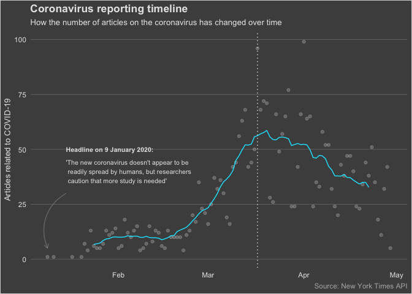

Emerging trends in the reporting of the coronavirus
================

Context
-------

As of today, we are currently in the midst of one of the most disruptive pandemics in history. I am of course referring to COVID-19.

(Continue later)

Load required packages
----------------------

For this script, we will leverage the following libraries:

``` r
library(tidyverse)
library(tidytext)
library(lubridate) # for working with dates and times
library(zoo) # for the rollmean() function

theme_set(theme_light())
```

Import article metadata
-----------------------

Note that this data was originally acquired via the [New York Times API](https://developer.nytimes.com/apis). Once you sign up, you will be issued with an API key which you can use to access metadata on thousands of different article types.

In this case I have used the 'Archive API' which allows me to acquire all NYT article metadata (e.g. headline, article description and more) for a given month - I have created a simple script to extract this data via the R package `jsonlite` for multiple months (January to April as of today):

``` r
archive_raw <- read_csv(file = data_path)

glimpse(archive_raw)
```

    ## Rows: 28,535
    ## Columns: 7
    ## $ article_id          <dbl> 1, 2, 3, 4, 5, 6, 7, 8, 9, 10, 11, 12, 13, 1…
    ## $ article_headline    <chr> "‘A Different Era’: Anti-Semitic Crimes, and…
    ## $ article_description <chr> "Attacks have been traditionally underreport…
    ## $ source              <chr> "The New York Times", "The New York Times", …
    ## $ publication_date    <date> 2020-01-03, 2020-01-01, 2020-01-02, 2020-01…
    ## $ section             <chr> "U.S.", "Arts", "Movies", "Opinion", "Fashio…
    ## $ word_count          <dbl> 1015, 1015, 2076, 1145, 1958, 1422, 1220, 13…

As you can see, we have a total of 28,535 observations split across 7 different variables, spanning the period from 1 January 2020 to 30 April 2020. I am in the process of compiling a small package to allow other users to critique and leverage the aforementioned personal script that I created to extract this data for their own purposes.

Data pre-processing
-------------------

The data has already undergone a certain level of pre-processing as the API returns data in a JSON format, which had to be engineered back into the `tibble` format.

However, there is still work to do: what we would like, ideally, is a dataset where each word occupies one row (this is often called an 'unnested' dataframe) - this will make it easier to count words, apply models and perform correlation analyses later on. We'll also want to split the `publication_date` variable into its constituents (year, month, day) as this will make it easier to analyse trends by each respective constituent. We will also calculate a `cum_time_elapsed` variable to indicate when each article was released relative to the new year.

We will make the slightly bold decision to unite the headline and description into one field. This is based on a few assumptions: (i) there is no significant difference in the nature of a headline as compared with an article description *in terms of its content*; and (ii) more words is better than less (why analyse *only* the description field when we could combine it with the headline field?). By doing this we are essentially creating a 'bag of words' column.

We will retain a copy of the data without the unnesting procedure applied just incase we need it.

``` r
new_year <- date("2020-01-01")

archive_clean <- archive_raw %>%
  mutate(article_id = row_number(), # unfortunately, in the process of calling the API I messed up my calculation of this column so I have overwritten it here
         publication_day = day(publication_date),
         publication_month = month(publication_date),
         publication_year = year(publication_date),
         cum_time_elapsed = publication_date - new_year) %>%
  unite(article_headline, article_description, col = "article_content", sep = " ---- ") %>%
  mutate(covid_flag = str_detect(article_content, regex("(coronavirus|covid)", ignore_case = T)))

archive_unnested <- archive_clean %>%
  unnest_tokens(output = "article_term", input = "article_content") %>%
  anti_join(tidytext::stop_words, by = c("article_term" = "word")) %>%
  filter(!str_detect(article_term, "[0-9]"))
```

Exploratory analysis
--------------------

Let's first examine the elephant in the room: just how did COVID-19 grow over time? It turns out that it follows a predictable logistic growth pattern:

``` r
archive_clean %>% 
  filter(covid_flag) %>% 
  count(publication_date) %>%
  arrange(publication_date) %>%
  mutate(n_ma = rollmean(x = n, k = 10, fill = list(NA, NULL, NA))) %>%
  ggplot() +
  geom_point(mapping = aes(x = publication_date, y = n), alpha = 0.25) +
  geom_line(mapping = aes(x = publication_date, y = n_ma), colour = "orange1") +
  labs(x = NULL,
       y = "Number of coronavirus articles",
       caption = "Source: New York Times API",
       title = "Number of reports on the coronavirus over time",
       subtitle = "A 10-day moving average is represented with an orange line")
```



Trend analysis
--------------

There are two types of trends that we want to focus on:

1.  **Growth**: which particular topics are becoming increasingly 'important' as time goes on?
2.  **Shrinkage**: which topics have fallen off the radar?

One possible way of modelling growth (or equivalently, shrinkage) in reporting trends is through the use of a logistic growth (logistic regression) model. Logistic regression models are typically applied in the context of classification problems in machine learning. But, it might surprise some practitioners to know that this statistical model was originally employed in the biological domain.

In this context, it is used to model variables which exhibit an initial period of exponential growth followed by a period of plateau from a certain point in time. The latter period of 'tailing off' is driven by some kind of constraint on the variable of interest. In epidemiology, for example, one can examine the initial phase of viral spread and note that it is indeed exponential but only up until a certain point - eventually, everyone who is infected either dies or people recover and gain immunity leading to a 'tailing off' in the initial spread.

Certain topics as reported in the media can be thought of in a similar way: as the coronavirus emerges some topics will become more newsworthy and increase exponentially up until a point: reporters cannot, of course, continue to discuss such topics at an exponential rate since there is a limited number of reporters at any one time and other topics emerge to fill their place.

Sentiment analysis
------------------

Coverage split by different countries
-------------------------------------
