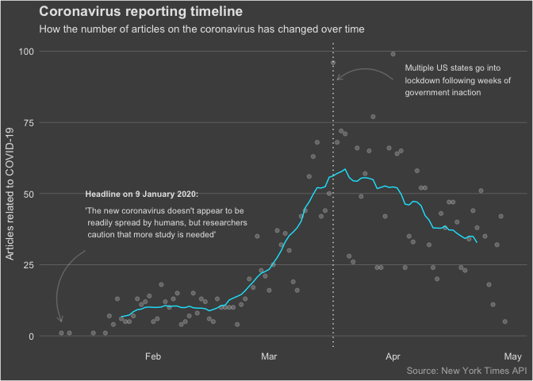
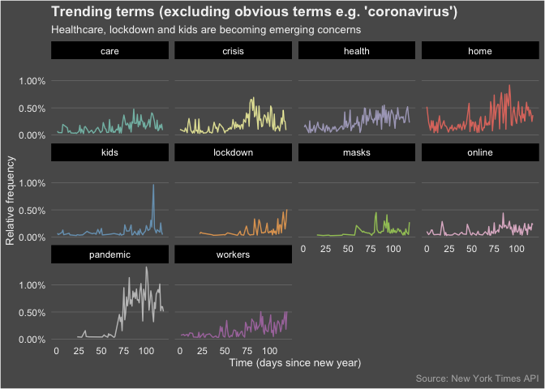
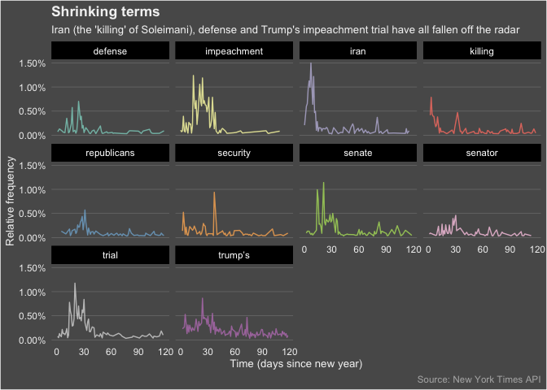
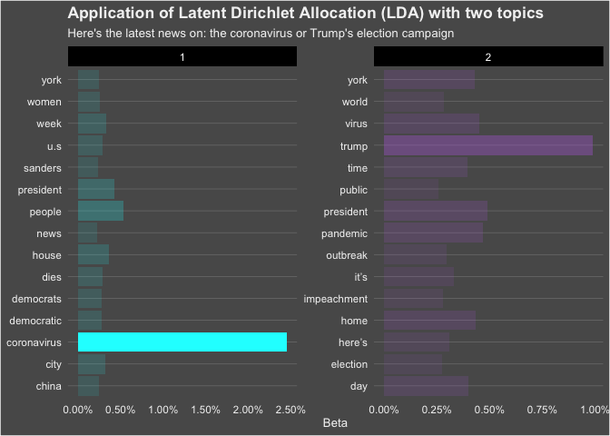

Emerging trends in the reporting of the coronavirus
================

Context
-------

As of today, we are currently in the midst of one of the most disruptive pandemics in history. I am of course referring to COVID-19.

(Continue later)

Load required packages
----------------------

For this script, we will leverage the following libraries:

``` r
library(tidyverse)
library(scales) # for percentage format axis labels
library(tidytext)
library(lubridate) # for working with dates and times
library(zoo) # for the rollmean() function
library(extrafont)
library(topicmodels)
library(widyr) # for correlation analyses
library(ggraph)
library(igraph)
library(broom) # for tidying model outputs

theme_set(theme_light())
loadfonts()
```

Import article metadata
-----------------------

Note that this data was originally acquired via the [New York Times API](https://developer.nytimes.com/apis). Once you sign up, you will be issued with an API key which you can use to access metadata on thousands of different article types.

In this case I have used the 'Archive API' which allows me to acquire all NYT article metadata (e.g. headline, article description and more) for a given month - I have created a simple script to extract this data via the R package `jsonlite` for multiple months (January to April as of today). I won't include my API key here (for obvious reasons) but you'll need to create a function like this to access the data:

``` r
## Archive API ##
nyt_archive_search <- function(api_key = "<INSERT YOUR KEY HERE>", year, month) {
  
  if (!stringr::str_detect(year, regex("^[0-9]{4}$")) | !stringr::str_detect(month, regex("^[0-9]{1}$"))) {
    stop("Year and month inputs must be numeric e.g. '2020' and '1' (for January) respectively", call. = FALSE)
  }
  
  jsonlite::fromJSON(paste0("http://api.nytimes.com/svc/archive/v1/", year, "/", month, ".json?api-key=", api_key),
           flatten = TRUE) %>%
    data.frame() %>%
    dplyr::transmute(article_id = row_number(),
                     article_headline = response.docs.headline.main,
                     article_description = response.docs.abstract, 
                     source = response.docs.source,
                     publication_date = as.Date(str_sub(response.docs.pub_date, start = 1L, end = 10L)),
                     section = response.docs.section_name,
                     word_count = response.docs.word_count) %>%
    tibble::as_tibble()
}
```

I am in the process of compiling a small package to allow other users to critique and leverage the code like this so that you can do the same.

I saved off my extraction to a CSV file for use in what follows:

``` r
# Clearly, the following path will not work on your local system (amend accordingly)
data_path <- "/Users/Johnny/Desktop/Data Science/R/Project NY Times/Extractor script/article-extractions/2020_1-to-4-extract.csv"
archive_raw <- read_csv(file = data_path)

glimpse(archive_raw)
```

    ## Rows: 28,535
    ## Columns: 7
    ## $ article_id          <dbl> 1, 2, 3, 4, 5, 6, 7, 8, 9, 10, 11, 12, 13, 1…
    ## $ article_headline    <chr> "‘A Different Era’: Anti-Semitic Crimes, and…
    ## $ article_description <chr> "Attacks have been traditionally underreport…
    ## $ source              <chr> "The New York Times", "The New York Times", …
    ## $ publication_date    <date> 2020-01-03, 2020-01-01, 2020-01-02, 2020-01…
    ## $ section             <chr> "U.S.", "Arts", "Movies", "Opinion", "Fashio…
    ## $ word_count          <dbl> 1015, 1015, 2076, 1145, 1958, 1422, 1220, 13…

As you can see, we have a total of 28,535 observations split across 7 different variables, spanning the period from 1 January 2020 to 30 April 2020.

Data pre-processing
-------------------

The data has already undergone a certain level of pre-processing as the API returns data in a JSON format, which had to be engineered back into the `tibble` format.

However, there is still work to do: what we would like, ideally, is a dataset where each word occupies one row (this is often called an 'unnested' dataframe) - this will make it easier to count words, apply models and perform correlation analyses later on. We'll also want to split the `publication_date` variable into its constituents (year, month, day) as this will make it easier to analyse trends by each respective constituent. We will also calculate a `cum_time_elapsed` variable to indicate when each article was released relative to the new year.

We will make the slightly bold decision to unite the headline and description into one field. This is based on a few assumptions: (i) there is no significant difference in the nature of a headline as compared with an article description *in terms of its content*; and (ii) more words is better than less (why analyse *only* the description field when we could combine it with the headline field?). By doing this we are essentially creating a 'bag of words' column.

We will retain a copy of the data without the unnesting procedure applied just incase we need it.

``` r
new_year <- date("2020-01-01")

archive_clean <- archive_raw %>%
  select(-article_id) %>%
  distinct() %>% # there are duplicates in the data that we need to get rid of
  mutate(article_id = row_number(),
         publication_day = day(publication_date),
         publication_month = month(publication_date),
         publication_year = year(publication_date),
         cum_time_elapsed = publication_date - new_year) %>%
  unite(article_headline, article_description, col = "article_content", sep = " ---- ") %>%
  mutate(covid_flag = str_detect(article_content, regex("(coronavirus|covid)", ignore_case = T)))

archive_unnested <- archive_clean %>%
  unnest_tokens(output = "article_term", input = "article_content") %>%
  anti_join(tidytext::stop_words, by = c("article_term" = "word")) %>%
  filter(!str_detect(article_term, "[0-9]"))
```

Exploratory analysis
--------------------

Let's first examine the elephant in the room: how did the reporting of the coronavirus emerge over time? Was it a gradual linear increase or did it exhibit a slightly more exponential period of growth?

It turns out that it follows a predictable logistic growth pattern, up until a certain point (specifically, the point of lockdown in the U.S. which occurred on the 17th of March 2020). From that point onwards, reporting has somewhat stabilised:

``` r
archive_clean %>% 
  filter(covid_flag) %>% 
  count(publication_date) %>%
  arrange(publication_date) %>%
  mutate(n_ma = rollmean(x = n, k = 10, fill = list(NA, NULL, NA))) %>%
  ggplot() +
  geom_point(mapping = aes(x = publication_date, y = n), alpha = 0.25) +
  geom_line(mapping = aes(x = publication_date, y = n_ma), colour = "orange1") +
  geom_vline(mapping = aes(xintercept = date("2020-03-17")), lty = "dashed", alpha = 0.50) +
  labs(x = NULL,
       y = "Articles related to COVID-19",
       caption = "Source: New York Times API",
       title = "Time series of coronavirus reporting frequency",
       subtitle = "A 10-day moving average is represented by an orange line") +
  theme(plot.title = element_text(face = "bold"),
        plot.subtitle = element_text(size = 10),
        text = element_text(family = "Arial"),
        plot.caption = element_text(colour = "gray70"))
```



Growing and shrinking themes
----------------------------

There are two types of trends that we want to focus on:

1.  **Growth**: which particular topics are becoming increasingly 'important' as time goes on?
2.  **Shrinkage**: which topics have fallen off the radar?

One possible way of modelling growth (or equivalently, shrinkage) in reporting trends is through the use of a logistic growth (logistic regression) model. Logistic regression models are typically applied in the context of classification problems in machine learning. But, it might surprise some practitioners to know that this statistical model was originally employed in the biological domain.

In this context, it is used to model variables which exhibit an initial period of exponential growth followed by a period of plateau from a certain point in time. The latter period of 'tailing off' is driven by some kind of constraint on the variable of interest. In epidemiology, for example, one can examine the initial phase of viral spread and note that it is indeed exponential but only up until a certain point - eventually, everyone who is infected either dies or people recover and gain immunity leading to a 'tailing off' in the initial spread.

Certain topics as reported in the media can be thought of in a similar way: as the coronavirus emerges some topics will become more newsworthy and increase exponentially up until a certain point: reporters cannot, of course, continue to discuss such topics at an exponential rate since there is a limited number of reporters at any one time and other topics will inevitably emerge to fill their place. Indeed, we have just observed this feature in a particular choice of topic, namely: 'coronavirus'.

Our plan is to regress an output variable, representing the relative frequency of a term in a given day, against time elapsed since the new year. With regards to the former, we can think of the number of times a given term appears in a given day as the number of 'successes' and the number of times that *any* term appears in a given day (i.e. the number of words we have for that day) as the number of 'trials'. This ratio is a basic indicator of term coverage.

In order to conduct our analysis, we need to first calculate the number of terms we have for each day since the new year - you can think of this as the number of trials we run each day:

``` r
cum_time_counts <- archive_unnested %>%
  count(cum_time_elapsed, name = "trials")
```

Then, we need to prepare the number of successes by counting how many times each word appears in each day.

One important point to make here is that we don't want to include *all* words in our analysis - some words (such as 'Bolton' in regards to Trump's impeachment trial) appear a high number of times on one or two days then vanish thereafter. This type of term, from our point of view, is only going to create unnecessary noise in our algorithm fitting process so we want to exclude them. One way of doing this is to require that all words included in our analysis appear a certain number of times overall - I've gone with 50 as this seemed to provide the most fair results:

``` r
logit_model_inputs <- archive_unnested %>%
  count(article_term, cum_time_elapsed, name = "successes") %>%
  add_count(article_term, name = "term_count") %>%
  filter(term_count > 50) %>% # only include words which appear more than a certain number of times overall over the past 4 months - we want to identify the signal, not the noise
  arrange(cum_time_elapsed) %>%
  left_join(cum_time_counts, by = "cum_time_elapsed") %>%
  mutate(p_est = successes / trials,
         cum_time_elapsed = as.integer(cum_time_elapsed)) %>%
  select(article_term, cum_time_elapsed, successes, trials, p_est, term_count) # purely for presentational purposes

logit_model_inputs
```

    ## # A tibble: 33,481 x 6
    ##    article_term cum_time_elapsed successes trials   p_est term_count
    ##    <chr>                   <int>     <int>  <int>   <dbl>      <int>
    ##  1 accused                     0         1    960 0.00104         61
    ##  2 act                         0         1    960 0.00104         56
    ##  3 agency                      0         1    960 0.00104         54
    ##  4 ago                         0         1    960 0.00104         59
    ##  5 ahead                       0         1    960 0.00104         72
    ##  6 america                     0         3    960 0.00312         94
    ##  7 american                    0         1    960 0.00104        109
    ##  8 amid                        0         1    960 0.00104         87
    ##  9 angeles                     0         1    960 0.00104         61
    ## 10 anti                        0         2    960 0.00208         53
    ## # … with 33,471 more rows

Now we are ready to fit a logistic regression to each individual term. Let *U*<sub>*t*</sub><sup>(*w*)</sup> denote the 'relative usage' of word *w* at time *t* - by 'relative usage' we mean how frequently word *w* is used relative to all other words at the same time *t*. Then *U*<sub>*t*</sub><sup>(*w*)</sup> is connected to the linear combination −(*β*<sub>0</sub><sup>(*w*)</sup> + *β*<sub>1</sub><sup>(*w*)</sup>*t*) by way of a [logistic transformation](https://en.wikipedia.org/wiki/Logistic_regression#Logistic_model).

The coefficient *β*<sub>1</sub><sup>(*w*)</sup> can be interpreted as the *rate* of growth (or shrinkage, if negative) associated with word *w*. Indeed, this formula is on a per-word basis; we will fit a logistic growth model to each respective term in the input data via `stats::glm()`.

We also make use of the `purrr::map()` function in order to apply the `glm()` function to each respective word:

``` r
logit_model_results <- logit_model_inputs %>%
  group_by(article_term) %>%
  nest() %>%
  mutate(logit_model = map(data, function(xx) glm(cbind(successes, trials - successes) ~ cum_time_elapsed, family = "binomial", data = xx)),
         logit_model_tidy = map(logit_model, broom::tidy)) %>%
  select(article_term, logit_model_tidy) %>%
  unnest(cols = c(logit_model_tidy)) %>%
  ungroup()

trending_terms <- logit_model_results %>%
  filter(term == "cum_time_elapsed") %>%
  arrange(desc(estimate)) %>%
  filter(!str_detect(article_term, regex("(april|virus)"))) %>% # see commentary below on this
  head(10) 

shrinking_terms <- logit_model_results %>%
  filter(term == "cum_time_elapsed") %>%
  arrange(estimate) %>%
  head(10) 
```

So now, if we inspect each respective set of terms we can identify which particular topics are growing exponentially in popularity and which topics have fallen off the radar. Note that I have filtered out some obvious trending terms (those which don't require such an analysis to know about): virus-related terms and the month of April (of course that will appear to be trending).

Let's start with trending terms. Note that 'estimate' in this context refers to the aforementioned *β*<sub>1</sub><sup>(*w*)</sup> that we discussed above. Thus, a higher estimate indicates a higher rate of growth (and vice versa):

``` r
logit_model_inputs %>%
  filter(article_term %in% trending_terms$article_term) %>%
  ggplot(mapping = aes(cum_time_elapsed, p_est, colour = article_term)) +
  geom_line() +
  facet_wrap(~article_term) +
  labs(x = "Time (days since new year)",
       y = "Relative frequency",
       colour = "Term",
       title = "Trending terms (excluding obvious terms e.g. 'coronavirus')",
       subtitle = "Healthcare, lockdown and the perils of organising elections are emerging concerns")
```


No surprises here, per se. We removed it but the word 'coronavirus' is indeed the highest growing term if it is accounted for. However, even in this set of 20 terms we start to notice other observable reporting trends: how the coronavirus may affect 'kids', the plight of 'health workers', the struggle to effectively organise 'elections' in the midst of a 'pandemic', the efficacy of 'masks'.

As for shrinking terms, this where things get a little more interesting:

``` r
logit_model_inputs %>%
  filter(article_term %in% shrinking_terms$article_term) %>%
  ggplot(aes(cum_time_elapsed, p_est, colour = article_term)) +
  geom_line() +
  facet_wrap(~article_term) +
  labs(x = "Time (days since new year)",
     y = "Relative frequency",
     colour = "Term",
     title = "Shrinking terms",
     subtitle = "Iran, defense and impeachment all make appearances")
```



There's a story - in fact, a history even - borne out of these terms. Whatever happened to the situation in Iran? Trump's impeachment? Though it isn't unsurpirising, these topics have clearly taken a back seat to the coronavirus.

What is Latent Dirichlet Allocation (LDA)?
------------------------------------------

Analysing emerging trends in certain words forces us to contemplate an important question: which topics are emerging in the media as a result of the coronavirus?

The way in which NLP practitioners achieve this is via the use of a Bayesian technique known as Latent Dirichlet Allocation (also known as 'LDA'). The basic assumption behind this technique is that 'documents' (or, in our case, newspaper articles) are composed of different mixtures of topics. For example, you might read an article about how nutrition impacts the performance of professional footballers. Such an article is not *just* 'sports' but neither is it just 'science' - in fact, it's a potentially complex mixture of topics.

A further string to the bow of LDA is that each topic is assumed to consist of a given distribution of words. For example, if we take the topic 'sports' once again, one can imagine that this topic draws (i) very frequently from words such as 'football', 'touchdown' or 'goal'; (ii) moderately frequently from words such as 'brain' (in relation to injuries perhaps); and (iii) doesn't really touch words like 'sewing' or 'chicken' at all.

With these two assumptions in mind, LDA imagines that 'documents' (newspaper articles) are 'generated' (written) by first deciding on which specific topics a given document will be about. After this has been done, the second step is to randomly sample words from a random selection of these topics in order to build newspaper articles. Of course, writers don't follow these steps in practice but this process does arguably reflect a subconscious decision-making process occurring in the writer's head. If they are writing about the latest results on election polls, for example, then clearly there *is* a certain limitation on the words they choose to write down and their frequency (words like 'election' will come up more frequently).

Applying LDA
------------

Now, of course we aren't generating newspaper articles: we already have those. What we're actually trying to do is reverse-engineer the aforementioned process. Think about it: if we know which ('Dirichlet') parameters led to the creation of the articles that we are able to observe then we will be able to identify the approximate topic distribution within each article as well as the approximate distribution of words within each topic. Therefore, the goal of LDA is just that: to discover which specific parameters led to the realisation of the articles that we are able to observe. At the beginning of this process, these parameters are unknown and thus termed 'latent'.

To successfully apply LDA, we employ `topicmodels::LDA()`. First, we need to 'cast' our data into a document-term matrix format:

``` r
archive_dtm <- archive_unnested %>%
  count(article_id, article_term) %>%
  cast_dtm(article_id, article_term, n)

archive_dtm
```

    ## <<DocumentTermMatrix (documents: 15998, terms: 27682)>>
    ## Non-/sparse entries: 222941/442633695
    ## Sparsity           : 100%
    ## Maximal term length: 32
    ## Weighting          : term frequency (tf)

Now we can apply LDA. Let's make the hypothesis that there are, say, `k = 2` different topics:

``` r
archive_lda <- LDA(x = archive_dtm, k = 2, control = list(seed = 1234))

archive_lda
```

    ## A LDA_VEM topic model with 2 topics.

``` r
archive_topics <- tidy(archive_lda, matrix = "beta")

archive_topics_terms <- archive_topics %>%
  group_by(topic) %>%
  top_n(15, beta) %>%
  ungroup() %>%
  arrange(topic, -beta)

archive_topics_terms %>%
  ggplot(aes(term, beta, fill = factor(topic))) +
  geom_col(show.legend = F, aes(alpha = beta)) +
  facet_wrap(~ topic, scales = "free") +
  coord_flip() +
  labs(x = NULL,
       y = "Beta",
       title = "Application of Latent Dirichlet Allocation (LDA) with two topics",
       subtitle = "Here's the latest news on: the coronavirus or Trump's election campaign")
```



Notice how the same words appear in each topic: this is an *advantage* of LDA over 'hard' clustering methods which naively separate words into different clusters. The algorithm recognises that words such as 'president' and 'coronavirus' can and do appear in the same articles despite being used in different contexts (e.g. suppose each article is actually about 'impeachment' and 'healthcare concerns', respectively).

Sentiment analysis
------------------

One question we might ask is whether the media (in this case the New York Times) has, knowlingly or not, caused a shift in sentiment over time.

We can have a stab at answering this by examining how the proportion of 'negative' words in each passing day has changed over time:

``` r
archive_unnested %>%
  inner_join(get_sentiments("bing"), by = c("article_term" = "word")) %>%
  group_by(publication_date) %>%
  summarise(total_negative = sum(sentiment == "negative"),
            total = n(),
            prop_neg = total_negative / total) %>%
  mutate(prop_neg_ma = rollmean(x = prop_neg, k = 10, fill = list(NA, NULL, NA))) %>%
  ggplot() +
  geom_point(aes(x = publication_date, y = prop_neg), alpha = 0.25) +
  geom_line(aes(x = publication_date, y = prop_neg_ma), colour = "tomato2") +
  scale_y_continuous(labels = percent_format()) +
  expand_limits(y = 0) +
  labs(x = "Publication date",
       y = "Proportion of 'negatives' relative to positives",
       title = "How sentiment is changing over time",
       subtitle = "Negative sentiment is fairly stationary however there is a marginal peak during March to April")
```



The graph above illustrates how important it is to use the `expand_limits()` functionality provided by `ggplot2`. If we didn't expand the limits then this graph would make it appear as if there were an increasing trend in negativity following the coronavirus outbreak.
