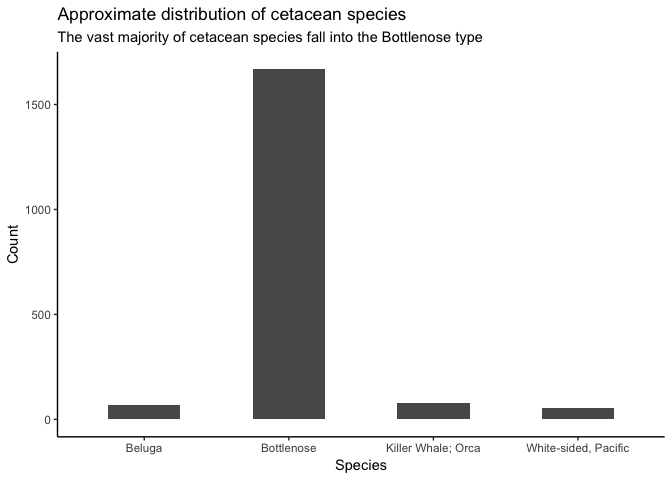
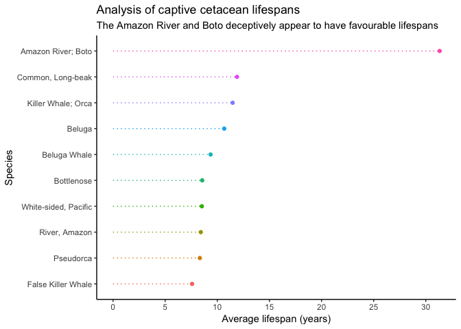
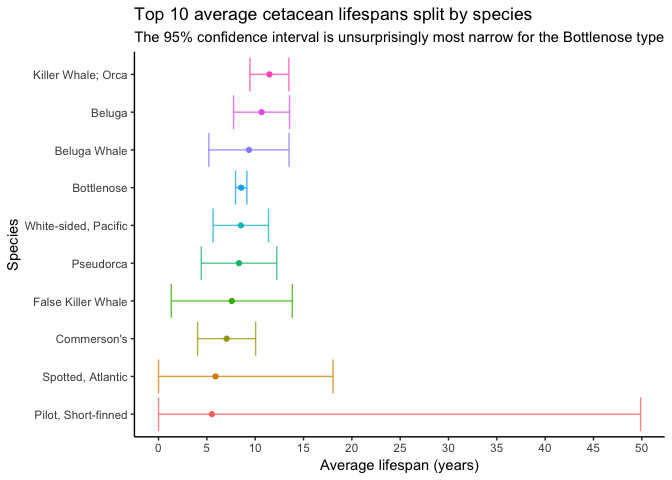
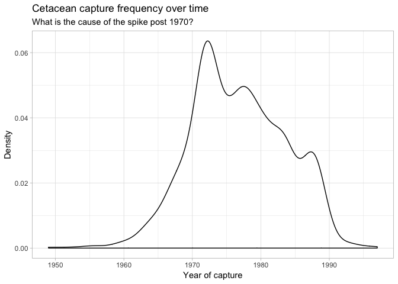
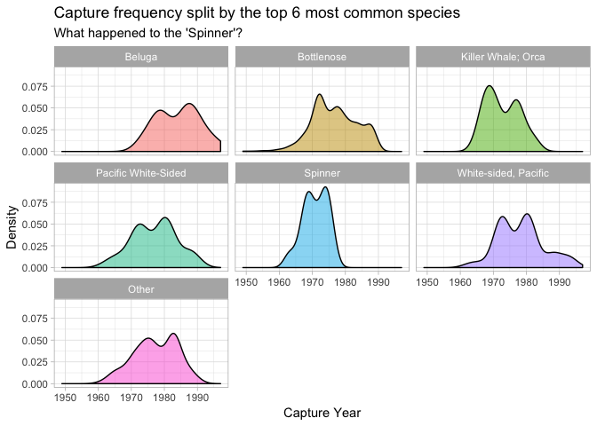
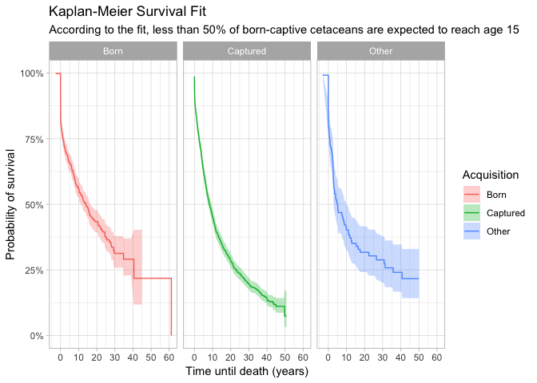

Captive Cetaceans: Exploratory Analysis & Mortality Investigation
================
Johnny Breen
24/03/2018

Introduction
============

This is my first ever contribution to the [TidyTuesday](https://github.com/rfordatascience/tidytuesday) project hosted on github. In this post, I am going to analyse a dataset submitted on various cetacean species (incase, like me, you don't know what a 'cetacean' is, it collectively refers to species such as dolphins and whales).

As a student actuary, I am quite interested in the study of mortality. Within actuarial work itself, mortality investigations are, unsurprisingly, limited to human beings (in the context of selling life insurance and annuities, where setting the appropriate premium is of paramount importance). However, given that this data contains valuable information on the death incidence of captive cetaceans, I'd like to make the focus of this analysis on cetacean *mortality*.

Background
==========

According to the [WWF](http://wwf.panda.org/knowledge_hub/endangered_species/cetaceans/threats/bycatch/), one of the leading causes of premature mortality in dolphins is incidental capture (otherwise known as by-catch). If any of you have had the chance to watch the excellent documentary Blackfish, you would have witnessed the incredibly mental torture and suffering imposed on cetaceans by captivity. Cetaceans are designed to travel; [according to conservation biologist Rob Williams](http://www.bbc.co.uk/earth/story/20160310-why-killer-whales-should-not-be-kept-in-captivity), "These are animals that coordinate their movements over scales of tens of kilometres. It's difficult to replicate that in any aquarium". It is estimated that many orcas travel over 62 miles every day so being imprisoned in something like a SeaWorld complex is extremely damaging to the cetacean way of living.

Preliminary Data Inspection
===========================

As a first step, let us load the cetacean data from the TidyTuesdays github repository:

``` r
library(tidyverse)
library(magrittr)
library(lubridate)
library(broom)

species_raw <- read_csv("https://raw.githubusercontent.com/rfordatascience/tidytuesday/master/data/2018/2018-12-18/allCetaceanData.csv") %>%
  select(-X1) # X1 appears to be a meaningless extra variable
```

As an initial step, let us investigate the distribution of various categorical variables within the dataset. We will start with the number of different species:

``` r
# most species are of the bottleneck & orca variety
species_raw %>%
  count(species, sort = TRUE)
```

    ## # A tibble: 37 x 2
    ##    species                      n
    ##    <chr>                    <int>
    ##  1 Bottlenose                1668
    ##  2 Killer Whale; Orca          79
    ##  3 Beluga                      68
    ##  4 White-sided, Pacific        56
    ##  5 Pacific White-Sided         41
    ##  6 Commerson's                 37
    ##  7 Spinner                     36
    ##  8 Beluga Whale                28
    ##  9 Short-Finned Pilot Whale    25
    ## 10 Pilot, Short-fin            22
    ## # ... with 27 more rows

``` r
# a quick bar plot confirms this - we choose species with a count of above 50
species_raw %>%
  add_count(species) %>%
  filter(n >= 50) %>%
  ggplot(aes(x = species)) +
  geom_bar(width = 0.5) +
  theme_classic() +
  labs(x = "Species",
       y = "Count",
       title = "Approximate distribution of cetacean species",
       subtitle = "The vast majority of cetacean species fall into the Bottlenose type")
```



One important driver of mortality in humans is gender type. It would be interesting to verify whether this phenomenon is replicated in captive cetaceans or not:

``` r
# the balance of gender is fairly even - this will make our gender-based estimates more reliable
species_raw %>%
  count(sex)
```

    ## # A tibble: 3 x 2
    ##   sex       n
    ##   <chr> <int>
    ## 1 F      1174
    ## 2 M       915
    ## 3 U       105

It might also be interesting to investigate how the transition into or out of SeaWorld (notorious for its mistreatment of dolphins - see ['Blackfish'](https://en.wikipedia.org/wiki/Blackfish_(film)) affects the mortality of cetaceans:

``` r
species_raw %>%
  transmute(seaworld_ind = str_detect(transfers, regex("SeaWorld", ignore_case = TRUE))) %>%
  count(seaworld_ind)
```

    ## # A tibble: 3 x 2
    ##   seaworld_ind     n
    ##   <lgl>        <int>
    ## 1 FALSE          374
    ## 2 TRUE           428
    ## 3 NA            1392

Exploratory Data Analysis
=========================

Mortality Analysis
------------------

Let's focus our analysis on deceased species.

We could focus our analysis solely on cetaceans where the date of birth is known to be accurate, but this would then exclude cetaceans who were born in the wild and subsequently captured - my gut feeling is that this could be an interesting splitting variable so I would like to retain this information. Be aware, however, that this implies the `lifespan` variable is estimated in some cases

Our first step should be to filter the data on 'deceased' species and, in addition to this, engineer the lifespan of each cetacean in the dataset.:

``` r
species_deceased <- species_raw %>%
  filter(status == "Died") %>% 
  mutate(lifespan = as.integer(difftime(statusDate, originDate, units = "days")) / 365.25)
```

So, now, for each species we have a known (or, in the case of captured cetaceans, estimated) lifespan. I will first narrow down the scope of the fields in the data

``` r
species_deceased_clean <- species_deceased %>%
  transmute(species, 
            sex, 
            accuracy, 
            acquisition, 
            originDate,
            seaworld_ind = ifelse(str_detect(transfers, regex("SeaWorld", ignore_case = TRUE)), "SeaWorld by-catch", "Other by-catch"), 
            lifespan) %>%
  mutate_if(is.character, as.factor)

species_deceased_clean 
```

    ## # A tibble: 1,558 x 7
    ##    species   sex   accuracy acquisition originDate seaworld_ind   lifespan
    ##    <fct>     <fct> <fct>    <fct>       <date>     <fct>             <dbl>
    ##  1 Bottleno… M     e        Capture     1974-07-10 Other by-catch    NA   
    ##  2 Commerso… F     e        Capture     1983-11-23 SeaWorld by-c…    32.2 
    ##  3 Commerso… M     a        Born        1993-09-16 SeaWorld by-c…    20.6 
    ##  4 Commerso… M     a        Born        1998-10-23 SeaWorld by-c…    15.2 
    ##  5 Bottleno… F     e        Capture     1960-11-01 Other by-catch    17.5 
    ##  6 Bottleno… M     e        Capture     1964-01-01 Other by-catch    10.7 
    ##  7 Bottleno… F     e        Capture     1964-08-15 Other by-catch    25.4 
    ##  8 Bottleno… M     e        Capture     1972-11-28 Other by-catch     2.78
    ##  9 Bottleno… F     e        Capture     1973-08-02 Other by-catch    21.4 
    ## 10 Bottleno… M     e        Capture     1975-05-13 Other by-catch     3.21
    ## # ... with 1,548 more rows

Let's first review how the lifespan of captive cetaceans vary across different species types:

``` r
species_deceased_clean %>%
  group_by(species) %>%
  summarise(avg_lifespan = mean(lifespan, na.rm = TRUE)) %>%
  ungroup() %>%
  mutate(species = fct_reorder(species, avg_lifespan)) %>%
  top_n(10, avg_lifespan) %>%
  ggplot(aes(x = avg_lifespan, y = species, colour = species)) +
  geom_point(show.legend = FALSE) +
  geom_segment(aes(x = 0,
                   xend = avg_lifespan,
                   y = species,
                   yend = species),
                   linetype = 'dotted', show.legend = FALSE) +
  expand_limits(x = 0) +
  scale_x_continuous(breaks = seq(0, 35, 5)) +
  theme_classic() +
  labs(x = "Average lifespan (years)",
       y = "Species",
       title = "Analysis of captive cetacean lifespans",
       subtitle = "The Amazon River and Boto deceptively appear to have favourable lifespans")
```



It can be very tempting to draw statistical conclusions from a plot like this; however, it should be noted that we previously inspected the distribution of species available in the data and the *vast* majority of cetaceans fell under the 'Bottlenose' category. This means that the high lifespan of the Amazon River / Boto species is slightly suspicious and may be due to a sampling error. We can confirm the distribution of various species by quick inspection of the variable in the deceased data:

``` r
# top 10 species
species_deceased_clean %>%
  count(species) %>%
  arrange(desc(n))
```

    ## # A tibble: 34 x 2
    ##    species                      n
    ##    <fct>                    <int>
    ##  1 Bottlenose                1119
    ##  2 Killer Whale; Orca          56
    ##  3 Beluga                      44
    ##  4 White-sided, Pacific        43
    ##  5 Pacific White-Sided         41
    ##  6 Commerson's                 33
    ##  7 Spinner                     33
    ##  8 Beluga Whale                28
    ##  9 Short-Finned Pilot Whale    25
    ## 10 Pseudorca                   18
    ## # ... with 24 more rows

``` r
# bottom 10 species
species_deceased_clean %>%
  count(species) %>%
  arrange(n)
```

    ## # A tibble: 34 x 2
    ##    species                      n
    ##    <fct>                    <int>
    ##  1 Atlantic Spotted             1
    ##  2 Common, Long-beak            1
    ##  3 River, Amazon                1
    ##  4 Spotted, Pantropical         1
    ##  5 Tucuxi                       1
    ##  6 Unspecified Pilot Whales     1
    ##  7 Amazon River; Boto           2
    ##  8 Common; Saddleback           2
    ##  9 Pilot, Short-finned          2
    ## 10 Atlantic White- Sided        3
    ## # ... with 24 more rows

Indeed, the top 10 and bottom 10 pulls of the data, as shown above, demonstrate that the representation in each category can be pivotal when drawing conclusions from the data. What might be more instructive is to construct confidence intervals of species lifespan which would take into account the number of data points available in each species type:

``` r
species_deceased_conf <- species_deceased_clean %>%
  filter(!is.na(lifespan)) %>%
  add_count(species) %>%
  filter(n > 1) %>% # a confidence interval does not make sense for one single data point
  select(species, lifespan) %>%
  nest(lifespan) %>%
  mutate(lifespan_data = map(data, ~ t.test(pull(.)))) %>% # note that 'data' refers to the nested lifespan variable - we're deriving confidence intervals (via the t.test function) for each species
  mutate(lifespan_intervals = map(lifespan_data, ~ tidy(.))) %>% # 'tidy' is from the broom package - it will transform the results of the t.test, for each species, into a corresponding line of data
  unnest(lifespan_intervals) %>%
  transmute(species, avg_lifespan = estimate, lifespan_low = ifelse(conf.low < 0, 0, conf.low), lifespan_high = conf.high) # the lower end of a confidence interval can stray below zero since we are implicitly assuming that each of the species' average lifespan is normally distributed - for sensibility, we set any conf.low values below zero to zero 
```

Now that we have derived a reasonable set of confidence intervals, we can plot the average survival times for each species type once again (this time we will include a confidence band):

``` r
species_deceased_conf %>%
  top_n(10, avg_lifespan) %>%
  inner_join(count(species_deceased_clean, species)) %>%
  mutate(species = fct_reorder(species, avg_lifespan)) %>%
  ggplot(aes(x = avg_lifespan, y = species, colour = species)) +
  geom_point(show.legend = F) +
  geom_errorbarh(aes(xmin = lifespan_low, xmax = lifespan_high), alpha = 0.75, show.legend = F) +
  theme_classic() +
  scale_x_continuous(breaks = seq(0, 50, 5)) +
  labs(x = "Average lifespan (years)",
       y = "Species",
       title = "Top 10 average cetacean lifespans split by species",
       subtitle = "The 95% confidence interval is unsurprisingly most narrow for the Bottlenose type")
```



This plot is more informative, in my opinion: we are able to observe the scope of each lifespan estimate, as is reflected by the width of the confidence intervals. For example, we now know with 95% confidence that the captive Bottlenose lifespan estimate ought to lie between roughly 8 to 10 years. By contrast, the average lifespan of a False Killer Whale, according to this plot, could lie anywhere between 2-ish and 14-ish years making it more difficult to make statistical conclusions about the False Killer Whale's mortality rating.

Time-based Analysis
-------------------

Stepping back from mortality for a moment, it might be interesting from an exploratory point of view to investiagte how capture rates have changed in prevalence over time:

``` r
# aggregate plot
species_raw %>%
  filter(acquisition == "Capture") %>%
  ggplot(aes(x = year(originDate))) + 
  geom_density() +
  theme_light() +
  labs(title = "Cetacean capture frequency over time",
       subtitle = "What is the cause of the spike post 1970?",
       x = "Year of capture",
       y = "Density") 
```



``` r
# by species
species_raw %>%
  filter(acquisition == "Capture") %>%
  mutate(species = fct_lump(species, n = 6)) %>%
  ggplot(aes(x = year(originDate), fill = species)) + 
  geom_density(show.legend = FALSE, alpha = 0.5) + 
  facet_wrap(~species) +
  theme_light() +
  labs(x = "Capture Year",
       y = "Density", 
       title = "Capture frequency split by the top 6 most common species",
       subtitle = "What happened to the 'Spinner'?")
```



According to information on Wikipedia amost half of all spinner dolphins were killed in the 30 years after purse seine fishing for tuna began in the 1950s. I wasn't aware of this phenomenon but it could be a potential reason as to why the distribution of the spinner capture rate is so markedly different from the others within the range 1955-ish to 1980-ish.

A more general phenomenon to inspect would be how capture / born / rescue rates have changed over time:

``` r
species_raw %>%
  filter(acquisition %in% c("Capture", "Rescue", "Born")) %>%
  ggplot(aes(x = year(originDate), fill = acquisition)) + 
  geom_histogram(alpha = 0.75, bins = 50) + 
  theme_light() +
  scale_x_continuous(breaks = seq(1940, 2020, 5), minor_breaks = seq(1940, 2020, 5)) +
  labs(x = "Captivity Date",
       y = "Count",
       title = "Histogram of acquisition types",
       subtitle = "The rate of capture appears to drop off rapidly after 1990")
```

    ## Warning: Removed 2 rows containing non-finite values (stat_bin).


It appears as though some kind of legislation came into effect at the beginning of the 1990s, which caused a sharp dropoff in the number of dolphins permitted to be captured from the wild. This was quite a revelation for me, as I was not aware of this phenomenon prior to visualisation. Upon further research, however, it does seem that the vast majority of aquatic entertainment complexes are now attempting to [breed cetaceans](https://us.whales.org/orca-captivity/) as opposed to capturing them in the wild.

Survival Modelling
==================

In order to fit a series of survival models to the data we will leverage two additional packages `survival` and `survminer`:

``` r
library(survival) # allows a survival model to be fit in basically one line of code!
library(survminer) # more of a visualisation package - we use a combination of this and ggplot / broom
```

    ## Loading required package: ggpubr

This time, we won't be restricting the data to deceased species. To be clear, we are interested in calculating the probability of death but in this data we have clear instances of *censoring*:

-   Random censoring is present as certain cetaceans have been released prematurely (a form of censoring that would not have been known to the data collectors at inception)
-   Right censoring is present for cetaceans which are currently alive, released or those for which the current status is unknown

These forms of censoring must be incorporated into our model. We will first engineer our survival data in a similar way to how we did it for the deceased species. Before we do so, note that the `status` of the cetacean is recorded as at 7 May 2017:

``` r
species_clean <- species_raw %>%
  transmute(species = fct_lump(species, n = 4), # the top four categories have at least 4 observations
            sex, 
            origin_period = as.factor(case_when(between(year(originDate), 1940, 1960) ~ "1940 - 1960",
                                      between(year(originDate), 1961, 1980) ~ "1961 - 1980",
                                      between(year(originDate), 1981, 2000) ~ "1981 - 2000",
                                      between(year(originDate), 2001, 2020) ~ "2001 - 2020")),
            acquisition = fct_lump(acquisition, n = 2), # gets rid of 'Stillbirth' and 'miscarriage' 
            seaworld_ind = ifelse(str_detect(transfers, regex("SeaWorld", ignore_case = TRUE)), "SeaWorld by-catch", "Other by-catch"), 
            lifespan = ifelse(status %in% c("Alive", "Released", "Unknown"), as.integer(difftime(as.Date("2017-05-07"), originDate, units = "days")) / 365.25, as.integer(difftime(statusDate, originDate, units = "days")) / 365.25),
            censored = ifelse(status %in% c("Alive", "Released", "Unknown"), 0, 1)) %>%
  mutate_if(is.character, as.factor) %>%
  replace_na(list(seaworld_ind = "Other by-catch"))
```

Kaplan-Meier Model
------------------

Let's first fit a non-parametric model to the data in the form of the Kaplan-Meier survival model.

I will split the data according to whether the cetacean was born in captivity, captured or otherwise:

``` r
species_clean_surv <- Surv(time = pull(species_clean, lifespan), event = pull(species_clean, censored))
species_KM <- survfit(species_clean_surv ~ acquisition, type = "kaplan-meier", data = species_clean)
species_KM %>% 
  tidy() %>%
  mutate(strata = case_when(str_detect(strata, "Born") ~ "Born",
                            str_detect(strata, "Capture") ~ "Captured",
                            TRUE ~ "Other")) %>%
  ggplot(aes(x = time, y = estimate)) + 
  geom_step(aes(colour = strata)) + 
  geom_ribbon(aes(ymin = conf.low, ymax = conf.high, fill = strata), alpha = 0.3) + 
  theme_light() +
  facet_wrap(~strata) +  
  scale_x_continuous(breaks = seq(0, 60, 10)) +
  scale_y_continuous(labels = scales::percent_format()) +
  labs(x = "Time until death (years)",
       y = "Probability of survival",
       title = "Kaplan-Meier Survival Fit",
       subtitle = "According to the fit, less than 50% of born-captive cetaceans are expected to reach age 15",
       fill = "Acquisition",
       colour = "Acquisition") 
```



Judging by these model fits, less than 50% of cetaceans born into captivity make it past the age of approximately 15 years old. This is significantly lower than the life expectancy of cetaceans in the wild where life expectancies typically span the range of 30 to 50 years old.

You might have expected - according to your own logic - the survival probability of cetaceans born into captivity to be lower, on average, than those captured (see, for example, [this link](https://us.whales.org/2018/08/23/how-long-do-bottlenose-dolphins-survive-in-captivity/)). And you wouldn't be mistaken. However, here we must be careful: we must account for the fact that captured cetaceans live a certain portion of their life *prior* to being captured (captivity) so we should expect the time until death to be, in aggregate, slightly lower for this category of cetaceans.

Cox Proportional Hazards Model
------------------------------

Now we will use the same data, but this time we want to compare survival risks between different classes of species - for example, how much more likely is a male to die than a female? What about cetaceans caught in the last 20 years? To answer these questions we need to turn to the 'Cox Proportional Hazards' model.

A 'hazard' can be thought of as the instantaneous probability of transition from one 'state' to another - in this case, the states are 'Alive' and 'Dead'. The Cox proportional hazards model assumes that:

-   The 'hazard' of an individual life is dependent on (i) a *non-parametric* 'baseline' hazard dependent only on time; and (ii) a *parametric* regression-based model, parametrised by a set of time independent factors such as sex
-   The ratio of an individual's hazard to the 'baseline' hazard remains in a constant proportion over time

With these assumptions in mind, we can proceed to fit a model to the data:

``` r
species_coxph <- coxph(species_clean_surv ~ species + sex + seaworld_ind + origin_period, 
                   data = species_clean)
```

We can use the survminer `ggforest` function (it is essentially a wrapper around a more complicated ggplot which I do not have the time to create!) to quickly visualise the proportional differences in mortality according to the covariates specified above:

``` r
ggforest(species_coxph, data = species_clean, main = "Cetacean Hazard Ratios", refLabel = "Reference")
```


Note that each category (e.g. species, sex and so forth) begins with a 'reference' baseline value to which other values within that same category are compared to. For example, we can see from the plot above that, for example, if the dolphin was held captive in the period 1961 - 1980, then on average it had a 63% increased risk of death than those held captive in 1940 - 1960. That is only on average however - the confidence intervals exist for a reason. In general a hazard ratio of above 1 indicates an increased risk of transition to death and vice versa.

Here is what we can conclude from the plot above:

-   The relative risk of mortality appears to be ~ 26% lower for cetaceans who have spent time in SeaWorld - this surprises me slightly given what we know about SeaWorld as reported by the media. Nonetheless, it is key to remember that all of these species - regardless of their transit history - are ultimately *captive*. Therefore, whilst there appears to be a relative increase in the probability of survival for those mammals affiliated with SeaWorld, I am fairly certain that by-catch in general is detrimental to the health of any cetacean species. We're simply comparing 'bad' with 'even worse' here.
-   There is a extremely significant increase in the risk of death amongst species with an unknown gender. This is curious because, as can be observed, there is a non-trivial number of mammals (`N = 105`) contained within this category. Unfortunately, there is no further information on why the gender of these species is unknown.
-   The variance of mortality appears to be minimised amongst different species types; however, this could easily be because we omitted any species with a frequency of less than 50 from our analysis. A keen observer will note that the hazard ratios presented above appear to replicate the information communicated in the plot of confidence intervals we made earlier. In truth, we do not have sufficient data on each species to comment conclusively on which species suffer more than others.
-   On average, there seems to be a difference in mortality within different generations, with mortality gradually reducing every 20 years from 1960 to 2020. Note that there are only `N = 16` data points in the period 1940 - 1960 so this isn't the best reference to use; however, we can still clearly observe a decreasing trend in mortality risk over time.
