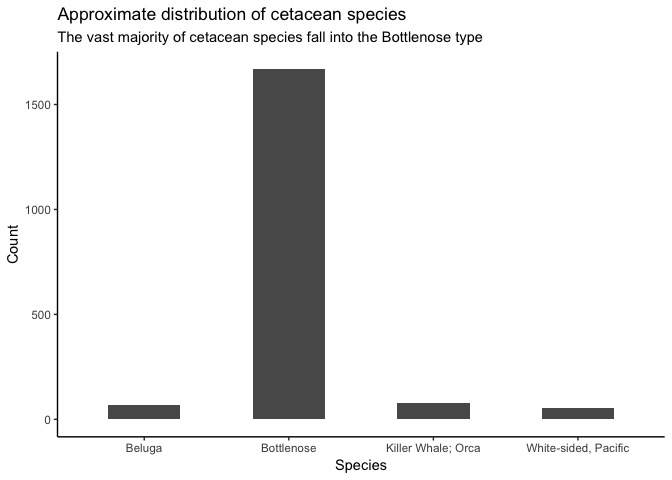
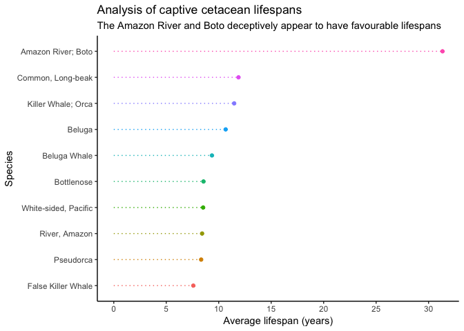
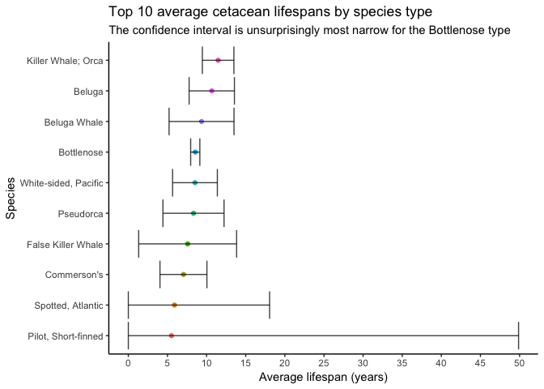
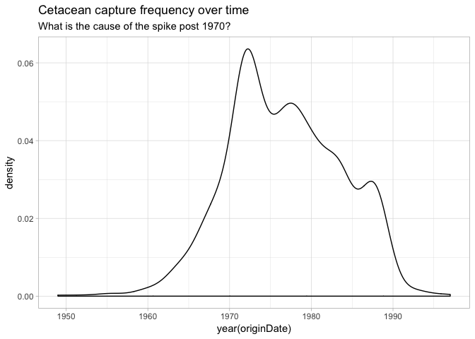
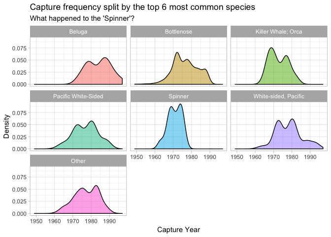
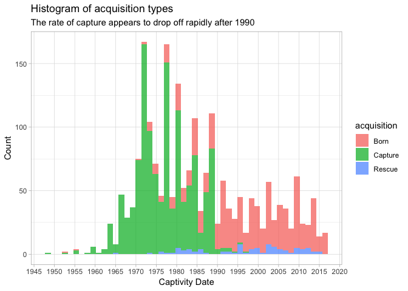
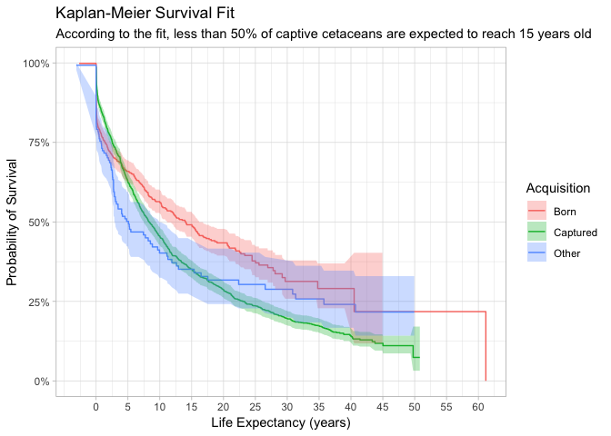

Captive Cetaceans: Exploratory Analysis & Mortality Investigation
================
Johnny Breen
27/12/2018

Introduction
============

This is my first ever contribution to the [TidyTuesday](https://github.com/rfordatascience/tidytuesday) challenges posted on github. In this post, I am going to analyse a dataset submitted on various cetacean species (i.e. dolphins, whales and porpoises).

As a student actuary, I take a great interest in the study of mortality and, normally, in our line of work it is the mortality of human beings that is analysed (in the context of providing life insurance and annuities). However, given that this data contains valuable information on the death rates of captive cetaceans, I'd like to make the focus of this analysis on cetacean *mortality*. According to the [WWF](http://wwf.panda.org/knowledge_hub/endangered_species/cetaceans/threats/bycatch/), one of the leading causes of premature mortality in dolphins is incidental capture (or otherwise known as by-catch). I do not doubt these claims, given that they are supported by extensive research and vocal scientific voices, and I am aware of the corrosive effect that imprisonment can have on the mental health of cetaceans through various documentaries I have watched over the past few years.

Preliminary Data Inspection
---------------------------

As a first step, let us load the cetacean data from the TidyTuesdays github repository:

``` r
library(tidyverse)
library(magrittr)
library(lubridate)
library(broom)

species_raw <- read_csv("https://raw.githubusercontent.com/rfordatascience/tidytuesday/master/data/2018/2018-12-18/allCetaceanData.csv") %>%
  select(-X1) # X1 appears to be a meaningless extra variable
```

As an initial step, let us investigate the distribution of various categorical variables within the dataset. We will start with the number of different species:

``` r
# most species are of the bottleneck & orca variety
species_raw %>%
  count(species, sort = TRUE)
```

    ## # A tibble: 37 x 2
    ##    species                      n
    ##    <chr>                    <int>
    ##  1 Bottlenose                1668
    ##  2 Killer Whale; Orca          79
    ##  3 Beluga                      68
    ##  4 White-sided, Pacific        56
    ##  5 Pacific White-Sided         41
    ##  6 Commerson's                 37
    ##  7 Spinner                     36
    ##  8 Beluga Whale                28
    ##  9 Short-Finned Pilot Whale    25
    ## 10 Pilot, Short-fin            22
    ## # ... with 27 more rows

``` r
# a quick bar plot confirms this - we choose species with a count of above 50
species_raw %>%
  add_count(species) %>%
  filter(n >= 50) %>%
  ggplot(aes(x = species)) +
  geom_bar(width = 0.5) +
  theme_classic() +
  labs(x = "Species",
       y = "Count",
       title = "Approximate distribution of cetacean species",
       subtitle = "The vast majority of cetacean species fall into the Bottlenose type")
```



One important driver of mortality in humans is gender type. It would be interesting to clarify whether this is replicated in cetaceans:

``` r
# the balance of gender is fairly even - this will make our gender-based estimates more reliable
species_raw %>%
  count(sex)
```

    ## # A tibble: 3 x 2
    ##   sex       n
    ##   <chr> <int>
    ## 1 F      1174
    ## 2 M       915
    ## 3 U       105

It might also be interesting to investigate how the transition into or out of SeaWorld (notorious for its mistreatment of dolphins - see ['Blackfish'](https://en.wikipedia.org/wiki/Blackfish_(film)) affects the mortality of dolphins:

``` r
species_raw %>%
  transmute(seaworld_ind = str_detect(transfers, regex("SeaWorld", ignore_case = TRUE))) %>%
  count(seaworld_ind)
```

    ## # A tibble: 3 x 2
    ##   seaworld_ind     n
    ##   <lgl>        <int>
    ## 1 FALSE          374
    ## 2 TRUE           428
    ## 3 NA            1392

### Exploratory Data Analysis

Mortality Analysis
------------------

Let's focus our analysis on deceased species now. Our first step should be to filter the data on 'deceased' species and, in addition to this, engineer the lifespan of each cetacean in the dataset.

We could focus our analysis solely on cetaceans where the date of birth is known to be accurate, but this would then exclude cetaceans who were born in the wild and subsequently captured - my gut feeling is that this could be an interesting splitting variable so I would like to retain this information. Just be aware that this implies the `lifespan` variable is estimated, in some cases:

``` r
species_deceased <- species_raw %>%
  filter(status == "Died") %>% 
  mutate(lifespan = as.integer(difftime(statusDate, originDate, units = "days")) / 365.25)
```

So, now, for each species we have a known (or in the case of captured cetaceans) lifespan. I will first narrow down the scope of the fields in the data

``` r
species_deceased_clean <- species_deceased %>%
  transmute(species, 
            sex, 
            accuracy, 
            acquisition, 
            originDate,
            seaworld_ind = ifelse(str_detect(transfers, regex("SeaWorld", ignore_case = TRUE)), "SeaWorld by-catch", "Other by-catch"), 
            lifespan) %>%
  mutate_if(is.character, as.factor)

species_deceased_clean 
```

    ## # A tibble: 1,558 x 7
    ##    species   sex   accuracy acquisition originDate seaworld_ind   lifespan
    ##    <fct>     <fct> <fct>    <fct>       <date>     <fct>             <dbl>
    ##  1 Bottleno… M     e        Capture     1974-07-10 Other by-catch    NA   
    ##  2 Commerso… F     e        Capture     1983-11-23 SeaWorld by-c…    32.2 
    ##  3 Commerso… M     a        Born        1993-09-16 SeaWorld by-c…    20.6 
    ##  4 Commerso… M     a        Born        1998-10-23 SeaWorld by-c…    15.2 
    ##  5 Bottleno… F     e        Capture     1960-11-01 Other by-catch    17.5 
    ##  6 Bottleno… M     e        Capture     1964-01-01 Other by-catch    10.7 
    ##  7 Bottleno… F     e        Capture     1964-08-15 Other by-catch    25.4 
    ##  8 Bottleno… M     e        Capture     1972-11-28 Other by-catch     2.78
    ##  9 Bottleno… F     e        Capture     1973-08-02 Other by-catch    21.4 
    ## 10 Bottleno… M     e        Capture     1975-05-13 Other by-catch     3.21
    ## # ... with 1,548 more rows

Let's first review how the lifespan of captive cetaceans vary across different species types:

``` r
species_deceased_clean %>%
  group_by(species) %>%
  summarise(avg_lifespan = mean(lifespan, na.rm = TRUE)) %>%
  ungroup() %>%
  mutate(species = fct_reorder(species, avg_lifespan)) %>%
  top_n(10, avg_lifespan) %>%
  ggplot(aes(x = avg_lifespan, y = species, colour = species)) +
  geom_point(show.legend = FALSE) +
  geom_segment(aes(x = 0,
                   xend = avg_lifespan,
                   y = species,
                   yend = species),
                   linetype = 'dotted', show.legend = FALSE) +
  expand_limits(x = 0) +
  scale_x_continuous(breaks = seq(0, 35, 5)) +
  theme_classic() +
  labs(x = "Average lifespan (years)",
       y = "Species",
       title = "Analysis of captive cetacean lifespans",
       subtitle = "The Amazon River and Boto deceptively appear to have favourable lifespans")
```



It can be very tempting to draw conclusions from a plot like this; however, it should be noted that we previously inspected the distribution of species available in the data and the *vast* majority of cetaceans fall under the 'Bottlenose' category. This means that the high lifespan of the Amazon River / Boto species is slightly suspicious. We can confirm the distribution of various species by quick inspection of the variable in the deceased data:

``` r
# top 10 species
species_deceased_clean %>%
  count(species) %>%
  arrange(desc(n))
```

    ## # A tibble: 34 x 2
    ##    species                      n
    ##    <fct>                    <int>
    ##  1 Bottlenose                1119
    ##  2 Killer Whale; Orca          56
    ##  3 Beluga                      44
    ##  4 White-sided, Pacific        43
    ##  5 Pacific White-Sided         41
    ##  6 Commerson's                 33
    ##  7 Spinner                     33
    ##  8 Beluga Whale                28
    ##  9 Short-Finned Pilot Whale    25
    ## 10 Pseudorca                   18
    ## # ... with 24 more rows

``` r
# bottom 10 species
species_deceased_clean %>%
  count(species) %>%
  arrange(n)
```

    ## # A tibble: 34 x 2
    ##    species                      n
    ##    <fct>                    <int>
    ##  1 Atlantic Spotted             1
    ##  2 Common, Long-beak            1
    ##  3 River, Amazon                1
    ##  4 Spotted, Pantropical         1
    ##  5 Tucuxi                       1
    ##  6 Unspecified Pilot Whales     1
    ##  7 Amazon River; Boto           2
    ##  8 Common; Saddleback           2
    ##  9 Pilot, Short-finned          2
    ## 10 Atlantic White- Sided        3
    ## # ... with 24 more rows

Indeed, the top 10 and bottom 10 pulls of the data, as shown above, demonstrate that the representation in each category can be pivotal when drawing conclusions from the data. What might be more instructive is to construct confidence intervals of species lifespan which would take into account the number of data points available in each species type:

``` r
species_deceased_conf <- species_deceased_clean %>%
  filter(!is.na(lifespan)) %>%
  add_count(species) %>%
  filter(n > 1) %>% # a confidence interval does not make sense for one single data point
  select(species, lifespan) %>%
  nest(lifespan) %>%
  mutate(lifespan_data = map(data, ~ t.test(pull(.)))) %>% # note that 'data' refers to the nested lifespan variable - we're deriving confidence intervals (via the t.test function) for each species
  mutate(lifespan_intervals = map(lifespan_data, ~ tidy(.))) %>% # 'tidy' is from the broom package - it will transform the results of the t.test, for each species, into a corresponding line of data
  unnest(lifespan_intervals) %>%
  transmute(species, avg_lifespan = estimate, lifespan_low = ifelse(conf.low < 0, 0, conf.low), lifespan_high = conf.high) # the lower end of a confidence interval can stray below zero since we are implicitly assuming that each of the species' average lifespan is normally distributed - for sensibility, we set any conf.low values below zero to zero 
```

Now that we have derived a reasonable set of confidence intervals, we can plot the average survival times for each species type once again:

``` r
species_deceased_conf %>%
  top_n(10, avg_lifespan) %>%
  inner_join(count(species_deceased_clean, species)) %>%
  mutate(species = fct_reorder(species, avg_lifespan)) %>%
  ggplot(aes(x = avg_lifespan, y = species)) +
  geom_point(aes(colour = species), show.legend = FALSE) +
  geom_errorbarh(aes(xmin = lifespan_low, xmax = lifespan_high), alpha = 0.75) +
  theme_classic() +
  scale_x_continuous(breaks = seq(0, 50, 5)) +
  labs(x = "Average lifespan (years)",
       y = "Species",
       title = "Top 10 average cetacean lifespans by species type",
       subtitle = "The confidence interval is unsurprisingly most narrow for the Bottlenose type")
```



Now we can see more clearly which estimates are likely to be closer to the true values than others (as is reflected by the width of the confidence intervals). Clearly, we can be quite sure that the Bottlenose lifespan estimate is more or less between around 8 and 10 years. Regarding the False Killer Whale however, the true value could lie anywhere between 2-ish and 14-ish years making the average a little bit meaningless.

Time-based Analysis
-------------------

One question I am curious about is how capture rates have changed in prevalence over time:

``` r
# aggregate plot
species_raw %>%
  filter(acquisition == "Capture") %>%
  ggplot(aes(x = year(originDate))) + 
  geom_density() +
  theme_light() +
  labs(title = "Cetacean capture frequency over time",
       subtitle = "What is the cause of the spike post 1970?") 
```



``` r
# by species
species_raw %>%
  filter(acquisition == "Capture") %>%
  mutate(species = fct_lump(species, n = 6)) %>%
  ggplot(aes(x = year(originDate), fill = species)) + 
  geom_density(show.legend = FALSE, alpha = 0.5) + 
  facet_wrap(~species) +
  theme_light() +
  labs(x = "Capture Year",
       y = "Density", 
       title = "Capture frequency split by the top 6 most common species",
       subtitle = "What happened to the 'Spinner'?")
```



According to information on Wikipedia amost half of all spinner dolphins were killed in the 30 years after purse seine fishing for tuna began in the 1950. I wasn't aware of this phenomenon but it could be a potential reason as to why the distribution of the spinner capture rate is so markedly different from the others.

A more general phenomenon to inspect would be how capture / born / rescue rates have changed over time:

``` r
species_raw %>%
  filter(acquisition %in% c("Capture", "Rescue", "Born")) %>%
  ggplot(aes(x = year(originDate), fill = acquisition)) + 
  geom_histogram(alpha = 0.75, bins = 50) + 
  theme_light() +
  scale_x_continuous(breaks = seq(1940, 2020, 5), minor_breaks = seq(1940, 2020, 5)) +
  labs(x = "Captivity Date",
       y = "Count",
       title = "Histogram of acquisition types",
       subtitle = "The rate of capture appears to drop off rapidly after 1990")
```

    ## Warning: Removed 2 rows containing non-finite values (stat_bin).



Clearly, some legislation has come into practice around the 1990s period which has caused a sudden dropoff in the number of dolphins captured. This is interesting to note because it wouldn't necessarily be anticipated prior to visualisation.

### Survival Modelling

In order to fit a series of survival models to the data we will leverage two additional packages `survival` and `survminer`:

``` r
library(survival)
library(survminer)
```

    ## Loading required package: ggpubr

This time, we won't be restricting the data to dead species only. Of course, we are interested in calculating the probability of death but in this data we have clear instances of *censoring* present:

-   Random censoring is present as certain cetaceans have been released prematurely (a form of censoring that would not have been known to the data collectors at inception)
-   Right censoring is present for cetaceans which are currently alive, released or those for which the current status is unknown

These forms of censoring must be incorporated into our model. We will first engineer our survival data in a similar way to how we did it for the deceased species. Before we do so, note that the status of the cetacean is recorded as at 7 May 2017:

``` r
species_clean <- species_raw %>%
  transmute(species = fct_lump(species, n = 4), # the top four categories have at least 4 observations
            sex, 
            accuracy, 
            acquisition = fct_lump(acquisition, n = 2), # gets rid of 'Stillbirth' and 'miscarriage' 
            seaworld_ind = ifelse(str_detect(transfers, regex("SeaWorld", ignore_case = TRUE)), "SeaWorld by-catch", "Other by-catch"), 
            lifespan = ifelse(status %in% c("Alive", "Released", "Unknown"), as.integer(difftime(as.Date("2017-05-07"), originDate, units = "days")) / 365.25, as.integer(difftime(statusDate, originDate, units = "days")) / 365.25),
            censored = ifelse(status %in% c("Alive", "Released", "Unknown"), 0, 1)) %>%
  mutate_if(is.character, as.factor) %>%
  replace_na(list(seaworld_ind = "Other by-catch"))
```

Kaplan-Meier Estimation
-----------------------

Let's first fit a non-parametric model to the data in the form of the Kaplan-Meier survival model. We could split on different variables such as `sex` and `acquisition` but since I plan to fit a cox proportional hazards model shortly (and such a model leverages covariates) I will probably keep this to a minimum. However, I think I will split the data according to whether the cetacean was born in captivity or captured

``` r
species_clean_surv <- Surv(time = pull(species_clean, lifespan), event = pull(species_clean, censored))
species_KM <- survfit(species_clean_surv ~ acquisition, type = "kaplan-meier", data = species_clean)
species_KM %>% 
  tidy() %>%
  mutate(strata = case_when(str_detect(strata, "Born") ~ "Born",
                            str_detect(strata, "Capture") ~ "Captured",
                            TRUE ~ "Other")) %>%
  ggplot(aes(x = time, y = estimate)) + 
  geom_step(aes(colour = strata)) + 
  geom_ribbon(aes(ymin = conf.low, ymax = conf.high, fill = strata), alpha = 0.3) + 
  theme_light() +
  scale_x_continuous(breaks = seq(0, 60, 5)) +
  scale_y_continuous(labels = scales::percent_format()) +
  labs(x = "Life Expectancy (years)",
       y = "Probability of Survival",
       title = "Kaplan-Meier Survival Fit",
       subtitle = "According to the fit, less than 50% of captive cetaceans are expected to reach 15 years old",
       fill = "Acquisition",
       colour = "Acquisition") 
```



Judging by this plot, if the data is taken to be a good indicator of reality, less than 50% of cetaceans in captivity (born or captured) make it past the age of approximately 10 years old. This is significantly lower than the life expectancy of cetaceans in the wild where the range from 30 - 50 years. Interesting to note is that one would have expected the survival probability of cetaceans born into captivity to be overall lower than those captured (for example, [here](https://us.whales.org/2018/08/23/how-long-do-bottlenose-dolphins-survive-in-captivity/) ). However, we must factor into the equation the fact that captured cetaceans do live a few extra years *outside* of captivity so this is expected.

Cox Proportional Hazards Model
------------------------------

In this instance, we will use the data from before, but this time we will be able to factor in the effect of different covariates (such as sex and captivity origin) on the probability of survival. A 'hazard' can be thought of as the instantaneous probability of transition from one 'state' to another - in this case, the states are 'Alive' and 'Dead'. The Cox proportional hazards model assumes that:

-   The 'hazard' of an individual life is dependent on (i) a *non-parametric* 'baseline' hazard dependent only on time; and (ii) a *parametric* regression-based model, parametrised by a set of time independent factors such as sex
-   The ratio of an individual's hazard to the 'baseline' hazard remains in a constant proportion over time

With these assumptions in mind, we can proceed to fit a model to the data:

``` r
species_coxph <- coxph(species_clean_surv ~ species + sex + acquisition + seaworld_ind, 
                   data = species_clean)
```

We can use the survminer `ggforest` function (it's basically a wrapper around a more complicated ggplot which I do not have the time to create!) to quickly inspect the relative differences in mortality due to the factors we fit the model on above:

``` r
ggforest(species_coxph, data = species_clean, main = "Cetacean Hazard Ratios", refLabel = "baseline")
```


Some notable observations:

-   The relative risk of mortality appears to be 26% lower for those cetaceans housed in SeaWorld - this surprises me slightly given what we know about SeaWorld as reported by the media. Nonetheless, it is key to remember that all of these species are *captive* so, in truth, any by-catch will be bad for the health and condition of any cetacean
-   There is a 16% increased risk of mortality to captured cetaceans (in comparison to those who were born in captivity).
-   The variance of species mortality appears to be minimised amongst the studied species; however, this could easily be because we omitted any species with a frequency of less than 50 from our analysis. A keen observer will note that this plot indeed replicates the earlier plot
