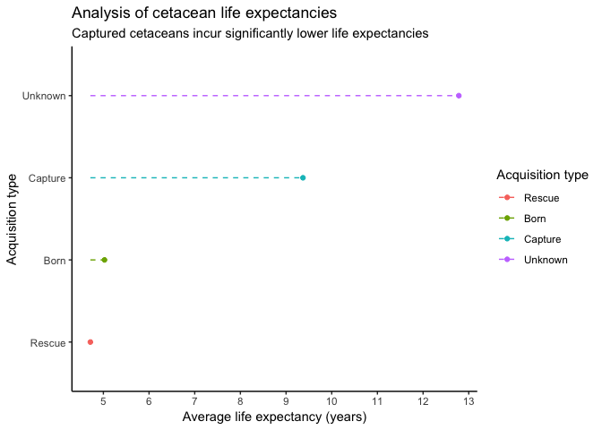
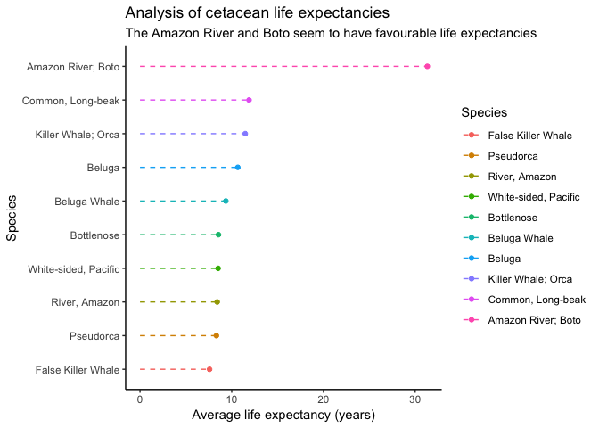
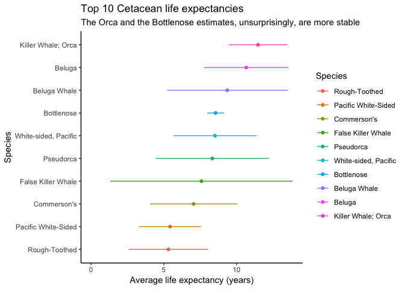

Study of Cetacean Species
================
Johnny Breen
27/12/2018

Introduction
============

This is my first ever contribution to the [TidyTuesday](https://github.com/rfordatascience/tidytuesday) challenges posted on github. I am going to analyse a dataset submitted on various cetacean species (i.e. dolphins, whales and porpoises).

Preliminary Inspection of Data
------------------------------

(written text to be filled in later on)

``` r
library(tidyverse)
library(magrittr)
library(lubridate)
library(broom)

species_raw <- read_csv("https://raw.githubusercontent.com/rfordatascience/tidytuesday/master/data/2018/2018-12-18/allCetaceanData.csv") %>%
  select(-X1) # X1 seems to be a meaningless extra variable

# most species are bottleneck & orca
species_raw %>%
  count(species, sort = TRUE)
```

    ## # A tibble: 37 x 2
    ##    species                      n
    ##    <chr>                    <int>
    ##  1 Bottlenose                1668
    ##  2 Killer Whale; Orca          79
    ##  3 Beluga                      68
    ##  4 White-sided, Pacific        56
    ##  5 Pacific White-Sided         41
    ##  6 Commerson's                 37
    ##  7 Spinner                     36
    ##  8 Beluga Whale                28
    ##  9 Short-Finned Pilot Whale    25
    ## 10 Pilot, Short-fin            22
    ## # ... with 27 more rows

``` r
# got quite a good balance of genders here
species_raw %>%
  count(sex)
```

    ## # A tibble: 3 x 2
    ##   sex       n
    ##   <chr> <int>
    ## 1 F      1174
    ## 2 M       915
    ## 3 U       105

``` r
# how many species transit through SeaWorld complexes - could be an interesting grouping variable to explore later on
species_raw %>%
  transmute(seaworld_ind = str_detect(transfers, regex("SeaWorld", ignore_case = TRUE))) %>%
  count(seaworld_ind)
```

    ## # A tibble: 3 x 2
    ##   seaworld_ind     n
    ##   <lgl>        <int>
    ## 1 FALSE          374
    ## 2 TRUE           428
    ## 3 NA            1392

``` r
# what's the difference between origin date (year animal entered captivity) and entry date (year that the animal entered the US captive population) - seems like the latter is when the animal entered captivity *in the US*
species_raw %>%
  mutate(date_equality_test = (originDate == entryDate)) %>%
  filter(date_equality_test == FALSE) 
```

    ## # A tibble: 21 x 22
    ##    species id    name  sex   accuracy birthYear acquisition originDate
    ##    <chr>   <chr> <chr> <chr> <chr>    <chr>     <chr>       <date>    
    ##  1 Bottle… NOA0… Nimb… M     a        1999      Born        1999-06-14
    ##  2 Bottle… NOA0… Mala… M     a        2000      Born        2000-06-13
    ##  3 Bottle… NOA0… Tatem M     a        2004      Born        2004-04-08
    ##  4 Bottle… NOA0… Lily  F     a        2004      Born        2004-04-09
    ##  5 Bottle… NOA0… Luna  F     a        2007      Born        2007-05-23
    ##  6 Bottle… NOA0… Berm… F     a        2007      Born        2007-06-06
    ##  7 Beluga  NOA0… Ferd… M     e        1970      Capture     1975-07-31
    ##  8 Beluga  NOA0… Allua F     e        1978      Capture     1985-07-14
    ##  9 Beluga  NOA0… Imaq  M     e        1987      Capture     1990-08-12
    ## 10 Bottle… NOA0… Nea   F     a        2007      Born        2007-06-03
    ## # ... with 11 more rows, and 14 more variables: originLocation <chr>,
    ## #   mother <chr>, father <chr>, transfers <chr>, currently <chr>,
    ## #   region <chr>, status <chr>, statusDate <date>, COD <chr>, notes <chr>,
    ## #   transferDate <date>, transfer <chr>, entryDate <date>,
    ## #   date_equality_test <lgl>

Investigation of deceased species
---------------------------------

Let's look at deceased species now. Questions we might be interested in answering include:

-   Is there any difference in time-to-death between captured and non-captured species?
-   Is the cause of death different for captured and non-captured species?

``` r
species_deceased <- species_raw %>%
  filter(status == "Died") %>% # let's focus on species which have deceased and those for which we *know* the birth year is accurate (indicated by "a")
  mutate(time_to_death = as.integer(difftime(statusDate, originDate, units = "days")) / 365.25)
```

``` r
# how does the life expectancy of dolphins differ according to acquisition type - the answer is: by some margin. Captured cetaceans appear 
species_deceased %>%
  group_by(acquisition) %>%
  summarise(avg_time_to_death = mean(time_to_death, na.rm = TRUE)) %>%
  ungroup() %>%
  mutate(acquisition = fct_reorder(acquisition, avg_time_to_death)) %>%
  ggplot(aes(x = acquisition, y = avg_time_to_death, colour = acquisition)) +
  geom_point() +
  geom_segment(aes(x = acquisition,
                   xend = acquisition,
                   y = min(avg_time_to_death, na.rm = TRUE),
                   yend = avg_time_to_death),
                   linetype = 'dashed') +
  coord_flip() +
  scale_y_continuous(breaks = seq(0, 15, 1)) +
  theme_classic() +
  labs(x = "Acquisition type",
       y = "Average life expectancy (years)",
       colour = "Acquisition type",
       title = "Analysis of cetacean life expectancies",
       subtitle = "Captured cetaceans incur significantly lower life expectancies")
```



``` r
# same plot as above but for species instead - a bit more illuminating
species_deceased %>%
  group_by(species) %>%
  summarise(avg_time_to_death = mean(time_to_death, na.rm = TRUE)) %>%
  ungroup() %>%
  mutate(species = fct_reorder(species, avg_time_to_death)) %>%
  top_n(10) %>%
  ggplot(aes(x = species, y = avg_time_to_death, colour = species)) +
  geom_point() +
  geom_segment(aes(x = species,
                   xend = species,
                   y = 0,
                   yend = avg_time_to_death),
                   linetype = 'dashed') +
  coord_flip() +
  expand_limits(y = 0) +
  theme_classic() +
  labs(x = "Species",
       y = "Average life expectancy (years)",
       colour = "Species",
       title = "Analysis of cetacean life expectancies",
       subtitle = "The Amazon River and Boto seem to have favourable life expectancies")
```



``` r
# it may appear that the Boto has an extraordinary life expectancy; however, that's only because it consists of only one observation
species_deceased %>% 
  filter(str_detect(species, "Amazon|Boto")) %>%
  select(species, originDate, statusDate, time_to_death)
```

    ## # A tibble: 3 x 4
    ##   species            originDate statusDate time_to_death
    ##   <chr>              <date>     <date>             <dbl>
    ## 1 River, Amazon      1966-09-01 1975-01-31          8.42
    ## 2 Amazon River; Boto NA         1985-08-26         NA   
    ## 3 Amazon River; Boto 1970-10-23 2002-02-20         31.3

``` r
# construction of life expectancy confidence intervals
species_deceased_conf <- species_deceased %>%
  filter(!is.na(time_to_death)) %>%
  add_count(species) %>%
  filter(n > 1) %>% # a confidence interval does not make sense for one single value (no variance can be estimated) %>%
  select(species, time_to_death) %>%
  nest(time_to_death) %>%
  mutate(death_intervals = map(data, ~ t.test(pull(.)))) %>%
  mutate(tidy_death_intervals = map(death_intervals, ~ tidy(.))) %>%
  unnest(tidy_death_intervals) 

# plot of life expectancies associated with certain cetacean species
species_deceased_conf %>%
  filter(conf.low >= 0) %>%
  arrange(desc(estimate)) %>%
  top_n(10, estimate) %>%
  mutate(species = fct_reorder(species, estimate)) %>%
  ggplot(aes(x = species, y = estimate, colour = species)) +
  geom_point() +
  geom_segment(aes(x = species,
                   xend = species,
                   y = conf.low,
                   yend = conf.high),
                   linetype = 'solid') +
  coord_flip() +
  expand_limits(y = 0) +
  theme_classic() +
  labs(x = "Species",
       y = "Average life expectancy (years)",
       colour = "Species",
       title = "Top 10 Cetacean life expectancies",
       subtitle = "The Orca and the Bottlenose estimates, unsurprisingly, are more stable")
```


