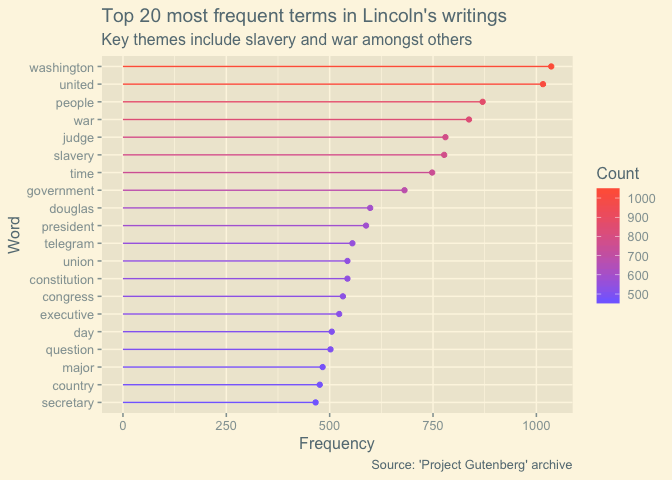
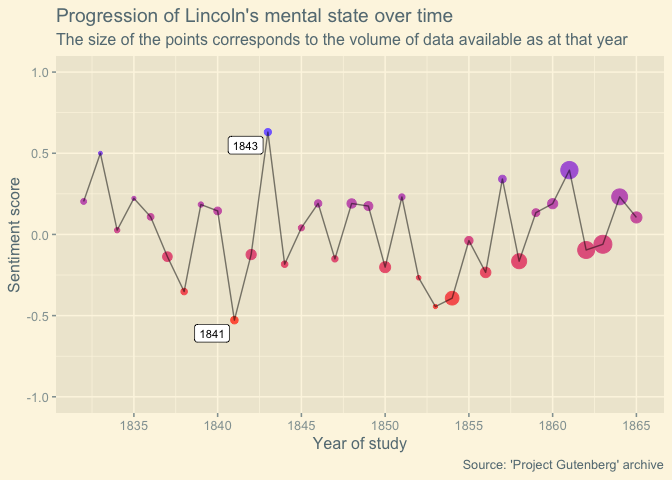
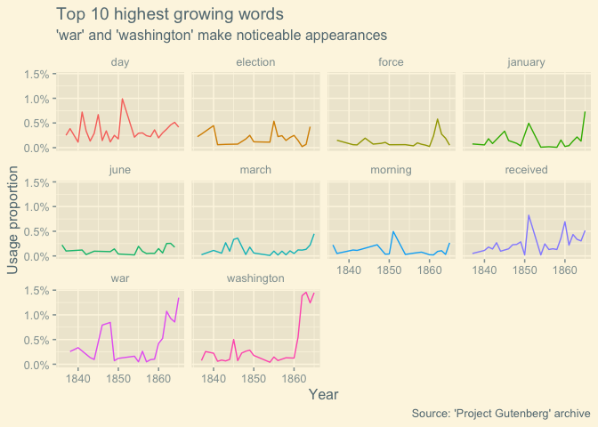
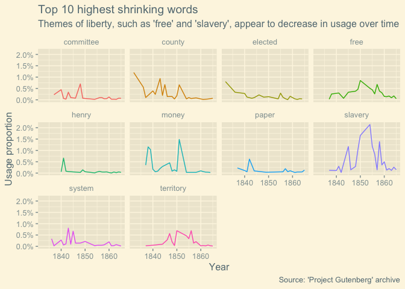

Project Gutenberg: Example Analysis
================
Johnny Breen
22/04/2019

Preamble on 'Project Gutenberg'
===============================

It's been a little while since I've practiced text mining so I thought I would analyse some textual data provided by Project Gutenberg. In case you were not aware, Project Gutenberg consists of various articles and literary contributions (amongst other things) written, in the main, by authors whose works are now in the US public domain and largely exempt from any copyright infringement. For the UK, the law is that copyright applies to somebody else's work until [70 years after their date of death](https://www.gov.uk/copyright/how-long-copyright-lasts).

Luckily for us, there is a package in R, [gutenbergr](https://cran.r-project.org/web/packages/gutenbergr/vignettes/intro.html), which allows you to easily download and access written articles stored within the Project Gutenberg database within the click of a button!

Background
==========

Upon inspecting the various repositories of data available to me in Project Gutenberg, I became rather fascinated by the prospect of analysing Abraham Lincoln's various letters and writings composed between the years 1832 and 1865 (Lincoln's year of death). I don't particularly know much about Abraham Lincoln, I'm ashamed to say, but I wanted to see how much I could learn about the former president by simply performing a short text-mining exercise on the extensive repository of written letters he compiled over the course of his political career.

This is not an in-depth analysis of Lincoln's writings; however, I was able to make some progress in answering the following questions:

-   What are Lincoln's commonly used terms?
-   Can we track Lincoln's mental state of mind over the course of his political career? Does he tend to use more negative language at certain points in time? Does this line up with historical moments in his career?
-   Which themes became more important to Lincoln during the course of his political career? Which themes became less relevant?

The latter two questions require a timestamp variable which must be engineered from the underlying data - more on this shortly!

Preliminaries
=============

First, we load the necessary packages for this short analysis - I've added a comment besides each package to explain how it is used within the remainder of this article:

``` r
library(gutenbergr) # allows you to download articles stored within the Project Gutenberg database
library(tidyverse) # includes various data manipulation packages, most notably 'tidyr' and 'dplyr'
library(tidytext) # facilitates text mining
library(broom) # allows you to 'tidy' model outputs into a tibble format
library(ggthemes) # purely for 'theme_solarized2()' - see below!
library(ggrepel) # purely for plotting aesthetically viable text labels on a ggplot2 visualisation

theme_set(theme_solarized_2()) # sets a global theme for ggplot2 visualisations
```

Data import
===========

The first step we must take is to download the articles he wrote using the `gutenbergr` package:

``` r
lincoln_raw <- gutenberg_download(2653:2659) # ids 2653 to 2659 encode Lincoln's writings between 1832 and 1865
```

    ## Determining mirror for Project Gutenberg from http://www.gutenberg.org/robot/harvest

    ## Using mirror http://aleph.gutenberg.org

Data cleansing
==============

First let's tidy the data. There was an initial challenge I had with this data - you can observe that the date associated with each article is actually stored within the textual field. I'll take a 'slice' of the data between two lines of data which I know contain a relevant date to demonstrate the issue (this slice appears to correspond to a letter from Roosevelt after Lincoln's death):

``` r
lincoln_raw %>%
  slice(131:140)
```

    ## # A tibble: 10 x 2
    ##    gutenberg_id text                                                       
    ##           <int> <chr>                                                      
    ##  1         2653 puts in antithesis. Abraham Lincoln, the rail-splitter, th…
    ##  2         2653 country lawyer, was one of the shrewdest and most enlighte…
    ##  3         2653 world, and he had all the practical qualities which enable…
    ##  4         2653 guide his countrymen; and yet he was also a genius of the …
    ##  5         2653 a leader who rose level to the greatest crisis through whi…
    ##  6         2653 or any other nation had to pass in the nineteenth century. 
    ##  7         2653 ""                                                         
    ##  8         2653 THEODORE ROOSEVELT                                         
    ##  9         2653 ""                                                         
    ## 10         2653 SAGAMORE HILL, OYSTER BAY, N. Y., September 22, 1905.

I wanted an extra variable to encode the year of each relevant writing. In order to achieve this, I'd have to use the `stringr` package from the `tidyverse`. My thought process was to:

-   Assume that any text with 4 digits corresponded to a year (not unreasonable but there could be exceptions);
-   Extract said year if it was detected in the textual field, using a simple regular expression
-   Since it seems to be the case that every letter starts with a date, assume that this date represents every line that follows *until* reaching the next date

I'm using the term 'date' very loosely here. What I am doing, in reality, is extracting the *year* (as opposed to the precise date) in which the letter was written and that is sufficient for the purpose of this exercise as we will see shortly. I also apply other pre-processing steps to the raw data, supplemented by comments below:

``` r
lincoln_clean <- lincoln_raw %>%
  unnest_tokens(output = word, input = text) %>%
  mutate(unique_id = row_number(), year = ifelse(str_detect(word, regex("\\d{4}")), word, NA_character_)) %>%
  fill(year) %>% # assume that the extracted year is constant for a given letter up until a new letter is written 
  mutate_at(vars(year), .funs = funs(as.integer)) %>%
  filter(between(year, 1832, 1865), # these are the only dates at which it was possible for Lincoln to have written something 
         !str_detect(word, "lincoln"), # I don't want Lincoln's name to be included as a value
         str_detect(word, "[a-z]")) %>% # get rid of any numbers or digits - these aren't 'words' I want to consider
  anti_join(stop_words) # get rid of words like 'to', 'the' or 'and' 

lincoln_clean
```

    ## # A tibble: 151,038 x 4
    ##    gutenberg_id word       unique_id  year
    ##           <int> <chr>          <int> <int>
    ##  1         2653 spoke             75  1864
    ##  2         2653 grave             83  1864
    ##  3         2653 question          84  1864
    ##  4         2653 government        87  1864
    ##  5         2653 strong            90  1864
    ##  6         2653 liberties         93  1864
    ##  7         2653 people            96  1864
    ##  8         2653 strong            99  1864
    ##  9         2653 maintain         102  1864
    ## 10         2653 existence        104  1864
    ## # … with 151,028 more rows

Exploratory data analysis
=========================

Word-Frequency Plot
-------------------

As is perhaps always the first step in any text mining exercise, let's have a quick look at which words seem to appear most frequently in Lincoln's writings:

``` r
lincoln_clean %>%
  count(word, sort = TRUE) %>%
  top_n(20, n) %>%
  mutate(word = fct_reorder(word, n)) %>%
  ggplot(aes(x = word, y = n, colour = n)) +
  geom_point() +
  geom_segment(aes(x = word, xend = word, y = 0, yend = n)) +
  scale_colour_gradient(low = "slateblue1", high = "tomato1") +
  coord_flip() +
  labs(x = "Word",
       y = "Frequency",
       colour = "Count",
       title = "Top 20 most frequent terms in Lincoln's writings",
       subtitle = "Key themes include slavery and war amongst others",
       caption = "Source: 'Project Gutenberg' archive")
```



You can see some clear themes emerging already such as slavery and war.

Sentiment tracker plot
----------------------

One cool thing we can do that is facilitated by the `tidytext` package is the ability to track individual 'sentiments' over time. By 'sentiment' we are referring to the 'positivity' or 'negativity' of emotion over time. This is enabled by the `tidytext::get_sentiments()` function and the correspoding `afinn` lexicon:

``` r
term_scores <- get_sentiments(lexicon = "afinn")

term_scores 
```

    ## # A tibble: 2,476 x 2
    ##    word       score
    ##    <chr>      <int>
    ##  1 abandon       -2
    ##  2 abandoned     -2
    ##  3 abandons      -2
    ##  4 abducted      -2
    ##  5 abduction     -2
    ##  6 abductions    -2
    ##  7 abhor         -3
    ##  8 abhorred      -3
    ##  9 abhorrent     -3
    ## 10 abhors        -3
    ## # … with 2,466 more rows

The `afinn` lexicon ranks 2,476 relatively common words (mainly verbs and adjectives) with a score ranging from `-5` to `+5` based on how 'negative' or 'positive' the word is deemed to be, respectively. So, for instance, `abandon` is a relatively negative word (with a score of `-2`) but not as negative as something like `abhor` (with a score of `-3`) - I think we can come to a consensus on that.

The power of having access to this lexicon is that you can perform a join on this table with the existing one word per row per document format provided by `lincoln_clean` to get an associated with the rating of each word in Lincoln's writings. You can either perform an `inner_join()` or a `left_join()` depending on whether you want to retain words without a match in the `afinn` lexicon. I went with the former:

``` r
lincoln_clean %>%
  inner_join(get_sentiments("afinn")) %>%
  group_by(year) %>%
  summarise(avg_sentiment = mean(score, na.rm = TRUE),
            year_count = n()) %>%
  ggplot(aes(x = year, y = avg_sentiment)) +
  geom_point(aes(size = year_count, colour = avg_sentiment), show.legend = FALSE) +
  geom_line(alpha = 0.50, colour = "black") +
  geom_label_repel(data = . %>% filter(!between(avg_sentiment, -0.5, 0.5)),
                   mapping = aes(label = year),
                   size = 3) +
  scale_colour_gradient(low = "tomato1", high = "slateblue1") +
  scale_x_continuous(breaks = seq(1830, 1865, 5)) +
  expand_limits(y = c(-1, 1)) +
  labs(x = "Year of study",
       y = "Sentiment score",
       title = "Progression of Lincoln's mental state over time",
       subtitle = "The size of the points corresponds to the volume of data available as at that year",
       caption = "Source: 'Project Gutenberg' archive")
```



Whilst this series appears to be relatively stationary, I've highlighted particularly strong periods of emotion with different colours (red is more negative). This is a good point to dig deeper into that period between 1840 and 1845 to figure out whether this supposed low-to-high jump is simply a result of insufficient data, especially during the years 1841 and 1843, or whether it is a reflection of a genuine emotional journey experienced by Lincoln during this period of time.

Indeed, a quick inspection of the year variable indicates that insufficient data might be the cause of the emotional spikes:

``` r
# an overall inspection of year-counts
lincoln_clean %>%
  count(year, sort = TRUE)
```

    ## # A tibble: 34 x 2
    ##     year     n
    ##    <int> <int>
    ##  1  1863 20797
    ##  2  1861 19688
    ##  3  1862 18650
    ##  4  1864 15767
    ##  5  1858 12988
    ##  6  1854  9859
    ##  7  1865  6007
    ##  8  1856  5347
    ##  9  1850  5062
    ## 10  1860  4033
    ## # … with 24 more rows

``` r
# filtering on 1841 and 1843...
lincoln_clean %>%
  count(year, sort = TRUE) %>%
  filter(year %in% c(1841, 1843))
```

    ## # A tibble: 2 x 2
    ##    year     n
    ##   <int> <int>
    ## 1  1841  1665
    ## 2  1843  1493

Still, with over 1,000 words in each year category there is perhaps some evidence that such writings may have reflected truly genuine emotional concerns on Lincoln's part. Only a closer inspection can reveal why. Let's dig into what is causing these spikes.

Let's do a little bit of digging on years 1841 and 1843:

``` r
lincoln_text_4143 <- lincoln_clean %>%
  filter(year %in% c(1841, 1843)) %>%
  nest(-year) %>%
  mutate(text_composition = map_chr(data, ~ str_flatten(.$word, collapse = " "))) %>%
  select(year, text_composition)

lincoln_text_4143[1,2, drop = TRUE] %>% str_sub(start = 1L, end = 1000L)
```

    ## [1] "john stuart depression springfield jan dear stuart miserable living feel equally distributed human family cheerful earth forbode remain impossible die appears fear unable attend business change scene remain home judge logan write remarks illinois legislature january house representatives january discussing continuation illinois michigan canal moore afraid holders scrip lose napier danger examined amount scrip principal mind obliged certificates altogether voluntary apprehend fall hands loss fall citizens section country scrip circulate extensive range country confined chiefly vicinity canal representatives section country favor bill propose protect leave care run risk reasonable suppose competent protect fair circular whig committee february appeal people illinois fellow citizens assembly adjourning assembled november bankrupt public treasury pecuniary embarrassments prevailing department society dilapidated public impending danger degradation expect representatives lose time devising "

``` r
cat("\n")
```

``` r
lincoln_text_4143[2,2, drop = TRUE] %>% str_sub(start = 1L, end = 1000L)
```

    ## [1] "resolutions whig meeting springfield illinois march object meeting stated springfield offered resolutions unanimously adopted resolved tariff duties imported producing sufficient revenue payment expenditures national government adjusted protect american industry indispensably prosperity american people resolved opposed direct taxation support national government resolved national bank properly restricted highly proper establishment maintenance sound currency cheap safe collection keeping disbursing public revenue resolved distribution proceeds sales public lands principles clay's bill accords nation illinois resolved recommend whigs congressional district nominate support approaching election candidate principles chances success resolved recommend whigs portions adopt rigidly adhere convention system nominating candidates resolved recommend whigs congressional district hold district convention monday composed delegates county equal double representatives assembly provided county delega"

The printouts above show the words which make up the first 1,000 characters of writings in 1841 and 1843 respectively. It's clear to see that the former can be considered to be much more 'negative' in its word composition than the latter. Lincoln is clearly discussing being 'miserable' and suffering from possible 'depression' - we see words like 'risk', 'fall' and 'loss' too. By contrast, the second writing is completely different - this is a writing about the adoption of an agreed political policy with seeming 'success'.

Growing and shrinking themes
----------------------------

The other exploratory analysis we wanted to track was whether there were any words used by Lincoln which became more prominent or less prominent over time.

To achieve this we fit a logistic regression model to each 'word' in the data where the y-variable is the incidence of a word in a given year and the x-variable is the year of study. In other words, for each word we have how many times that specific word was used in a certain year in relation to how many times *any* word was used in a certain year - i.e. we have the number of 'successes' and the number of 'trials' for each word and for each year.

First, we need to make sure that we don't include words which grow significantly over only two years but have no usage elsewhere - we want words that have been used fairly regulalry over the course of the 33 years of study. I will choose more than 20 appearances:

``` r
lincoln_reg_used_words <- lincoln_clean %>%
  distinct(word, year) %>%
  group_by(word) %>%
  summarise(total_appearances = n()) %>%
  filter(total_appearances > 20) %>% 
  pull(word) # words with at least 20 years of data

# have a quick inspection of what types of words are used regularly
set.seed(123)
lincoln_reg_used_words %>% sample(5)
```

    ## [1] "force"      "set"        "january"    "ten"        "understand"

``` r
lincoln_reg_used_words %>% sample(5)
```

    ## [1] "brought"  "missouri" "time"     "nation"   "late"

We only need the year and word variables to fit a logistic regression to each word:

``` r
year_counts <- lincoln_clean %>%
  count(year)

lincoln_counts <- lincoln_clean %>%
  select(year, word) %>%
  filter(word %in% lincoln_reg_used_words) %>%
  add_count(year, word) %>%
  inner_join(year_counts, by = c("year" = "year")) %>%
  group_by(year, word) %>%
  summarise(successes = sum(n.x), trials = sum(n.y)) %>%
  ungroup() %>%
  mutate(prop_success = successes / trials) %>%
  filter(trials > 1000) # for statistical significance

lincoln_slopes <- lincoln_counts %>%
  nest(-word) %>%
  mutate(log_mod = map(data, ~ glm(cbind(successes, trials - successes) ~ year, family = "binomial", data = .))) %>%
  unnest(map(log_mod, broom::tidy)) %>%
  filter(term == "year") %>%
  arrange(desc(estimate))

lincoln_slopes
```

    ## # A tibble: 177 x 6
    ##    word       term  estimate std.error statistic   p.value
    ##    <chr>      <chr>    <dbl>     <dbl>     <dbl>     <dbl>
    ##  1 january    year    0.385    0.0125      30.8  1.16e-208
    ##  2 washington year    0.150    0.00181     82.9  0.       
    ##  3 march      year    0.131    0.00951     13.8  3.31e- 43
    ##  4 war        year    0.0905   0.00182     49.8  0.       
    ##  5 june       year    0.0834   0.00717     11.6  2.81e- 31
    ##  6 received   year    0.0544   0.00348     15.6  4.88e- 55
    ##  7 day        year    0.0506   0.00216     23.4  9.66e-121
    ##  8 force      year    0.0504   0.00387     13.0  1.04e- 38
    ##  9 election   year    0.0468   0.00330     14.2  1.44e- 45
    ## 10 morning    year    0.0445   0.00901      4.94 7.75e-  7
    ## # … with 167 more rows

Now that we have fit a logistic model to each word we can extract trends in Lincoln's writings which emerged over time (the highest growing trends) and, equally, trends which appeared to regress over time. We can do this because the 'estimate' field in the table printed above reflects how correlated each word is with year of usage. For instance, 'january' has a coefficient estimate of `0.3853...` which implies an increase of one year corresponds to a `exp(0.38) = 46%` increase in the usage of 'january'.

``` r
lincoln_top_growing <- lincoln_slopes %>%
  top_n(10, estimate) %>%
  pull(word)

lincoln_top_shrinking <- lincoln_slopes %>%
  top_n(-10, estimate) %>%
  pull(word)
```

Let us now plot the growth or regression of each of these sets of words in a time series plot:

``` r
# words which Lincoln began to use more towards the end of his writings
lincoln_counts %>%
  filter(word %in% lincoln_top_growing) %>%
  ggplot(aes(x = year, y = prop_success, colour = word)) +
  geom_line(show.legend = FALSE) +
  facet_wrap(~word) +
  scale_y_continuous(labels = scales::percent_format()) +
  labs(x = "Year",
       y = "Usage proportion",
       title = "Top 10 highest growing words",
       subtitle = "'war' and 'washington' make noticeable appearances",
       caption = "Source: 'Project Gutenberg' archive")
```



``` r
# words which Lincoln started to use less frequently towards the end of his writings
lincoln_counts %>%
  filter(word %in% lincoln_top_shrinking) %>%
  ggplot(aes(x = year, y = prop_success, colour = word)) +
  geom_line(show.legend = FALSE) +
  facet_wrap(~word) +
  scale_y_continuous(labels = scales::percent_format()) +
  labs(x = "Year",
     y = "Usage proportion",
     title = "Top 10 highest shrinking words",
     subtitle = "Themes of liberty, such as 'free' and 'slavery', appear to decrease in usage over time",
     caption = "Source: 'Project Gutenberg' archive")
```



After a little bit of research, it doesn't surprise me that 'slavery' became much less prominent post 1860. One hypothesis I have (perhaps naively) is that the American Civil War broke out in 1861, by which point Lincoln had exhausted his thoughts on slavery and now found himself in a brutal war over the issue. The breakout of the war also goes some way to explain why words like 'war' and 'washington' shot up in prominence post 1860 - this might also explain the word 'received' as a potential correlator with war.

Conclusion
==========

We have only engaged in a brief, but nonetheless useful, analysis of Lincoln's written correspondence. There are many other routes I could have followed with this analysis, but ultimately decided not to in the interest of time. For instance, I could have inspected the difference between each of Lincoln's volume of writings in more detail through a tf-idf analysis or otherwise. I could have inspected words with a strong correlaton or cosine similarity. These are techniques which are explored in many text mining articles online but I haven't explored them in this post.

I'm currently researching [Latent Dirichlet Allocation (LDA)](https://en.wikipedia.org/wiki/Latent_Dirichlet_allocation) which is a type of topic model used in text mining. Broadly speaking it assembles textual data into different categories through Bayesian inference. I plan to include a series of posts very soon explaining some of the key parts of this algorithm - stay tuned!
