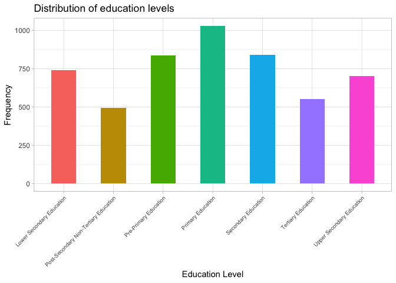
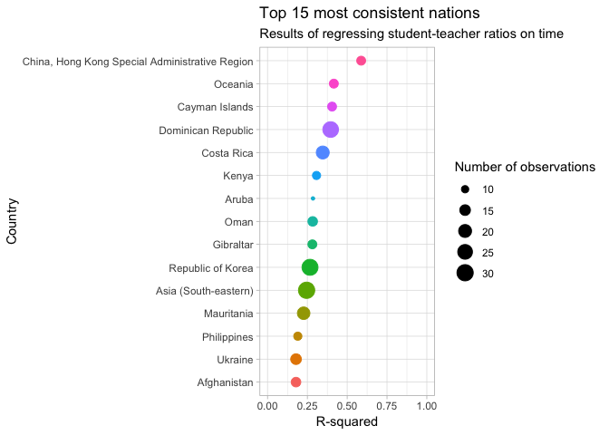
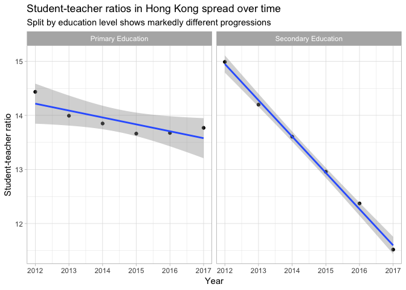
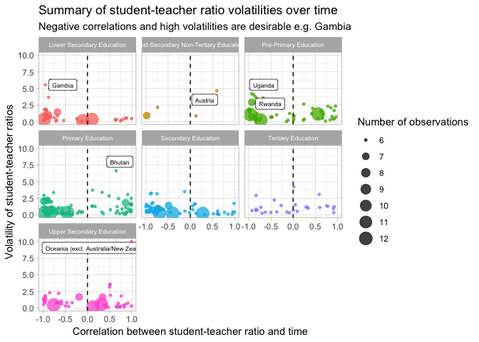

Teacher-Student Ratio Analysis
================
Johnny Breen
18/05/2019

Introduction
============

In this segment we perform a brief analysis of data on student-teacher ratios across countries worldwide - the data is from the [tidytuesday](https://github.com/rfordatascience/tidytuesday/blob/master/data/2019/2019-05-07/readme.md) segment on github.

Limited by time constraints and actuarial exams, this is a relatively short post; however, it showcases some of the functional tools you can use in `purrr` to make your code more powerful.

Data import
===========

Let's first read in the data from the github repo:

``` r
library(tidyverse)
library(ggrepel)
theme_set(theme_light())
# we use 'ts' to refer to 'teacher-student'
ts_ratio_raw <- readr::read_csv("https://raw.githubusercontent.com/rfordatascience/tidytuesday/master/data/2019/2019-05-07/student_teacher_ratio.csv")

ts_ratio_raw 
```

    ## # A tibble: 5,189 x 8
    ##    edulit_ind indicator country_code country  year student_ratio flag_codes
    ##    <chr>      <chr>     <chr>        <chr>   <int>         <dbl> <chr>     
    ##  1 PTRHC_2    Lower Se… MRT          Maurit…  2013         56.6  <NA>      
    ##  2 PTRHC_2    Lower Se… MRT          Maurit…  2014         51.9  <NA>      
    ##  3 PTRHC_2    Lower Se… MRT          Maurit…  2015         53.2  <NA>      
    ##  4 PTRHC_2    Lower Se… MRT          Maurit…  2016         38.2  <NA>      
    ##  5 PTRHC_1    Primary … COD          Democr…  2012         34.7  <NA>      
    ##  6 PTRHC_1    Primary … COD          Democr…  2013         37.1  <NA>      
    ##  7 PTRHC_1    Primary … COD          Democr…  2014         35.3  <NA>      
    ##  8 PTRHC_1    Primary … COD          Democr…  2015         33.2  <NA>      
    ##  9 PTRHC_3    Upper Se… SYR          Syrian…  2013          8.47 <NA>      
    ## 10 PTRHC_02   Pre-Prim… GNQ          Equato…  2012         17.5  <NA>      
    ## # … with 5,179 more rows, and 1 more variable: flags <chr>

Exploratory data analysis
=========================

First, let's have a little look at how many countries are contained in the dataset:

``` r
ts_ratio_raw %>%
  count(country) %>%
  arrange(desc(n))
```

    ## # A tibble: 232 x 2
    ##    country                                        n
    ##    <chr>                                      <int>
    ##  1 Latin America and the Caribbean               60
    ##  2 Small Island Developing States                60
    ##  3 World                                         60
    ##  4 Austria                                       42
    ##  5 China, Macao Special Administrative Region    42
    ##  6 Holy See                                      42
    ##  7 Uzbekistan                                    42
    ##  8 Ghana                                         40
    ##  9 Bahrain                                       39
    ## 10 Mexico                                        39
    ## # … with 222 more rows

We have 232 'countries' represented - although as you can see some of these are not countries, for example 'World'.

Next, let's have a look at the representation of different education levels:

``` r
ts_ratio_raw %>%
  ggplot(aes(x = indicator)) +
  geom_bar(width = 0.5, show.legend = FALSE, aes(fill = indicator)) +
  theme(axis.text.x = element_text(angle = 45, size = 7, hjust = 1)) +
  labs(x = "Education Level",
       y = "Frequency",
       title = "Distribution of education levels")
```



There appears to be a fairly even distribution of different education levels which will be useful if we plan to use this variable as a graphical facetting feature.

Let's have a little look at how the teacher-student ratios correlate (on a linear basis) with time. This will tell us which countries are showing the most consistent changes (good or bad) over time - to do this, we fit a series of linear models to each country in the dataset using `map_*()` functions from the package `purrr`:

``` r
fit_mod <- function(df, ord = 1) {
  lm(year ~ I(student_ratio^ord), data = df)
}

ts_ratio_rsq <- ts_ratio_raw %>%
  add_count(country) %>%
  filter(n > 10, !is.na(student_ratio), !is.na(year)) %>% # filter on countries with at least 10 data points
  nest(-country) %>%
  mutate(linear_mod = map(data, ~ fit_mod(df = .)),
         linear_mod_summary = map(linear_mod, ~ summary(.)),
         linear_mod_rsq = map_dbl(linear_mod_summary, "r.squared"),
         linear_mod_nobs = map_int(data, ~ nrow(.))) %>%
  arrange(desc(linear_mod_rsq))

# top 15 r-squared values
ts_ratio_rsq %>%
  mutate(country = fct_reorder(country, linear_mod_rsq)) %>%
  top_n(15, linear_mod_rsq) %>%
  ggplot(aes(x = country, y = linear_mod_rsq)) +
  geom_point(aes(colour = country, size = linear_mod_nobs)) +
  expand_limits(y = c(0, 1)) +
  coord_flip() +
  labs(y = "R-squared",
       x = "Country",
       title = "Top 15 most consistent nations",
       subtitle = "Results of regressing student-teacher ratios on time",
       size = "Number of observations") +
  guides(colour = "none")
```



Based on this, Hong Kong appears to be demonstrating a fairly consistent change over time. However, there are some limitations with this approach:

1.  We're lumping different education categories together. This is OK if all we care about is aggregate progress but do you remember the `indicator` variable which reflect education levels? Hong Kong, for instance, has two different trajectories for two different education levels:

    ``` r
      ts_ratio_raw %>%
      filter(str_detect(country, "Hong Kong")) %>%
      ggplot(aes(x = year, y = student_ratio)) +
      geom_point() +
      geom_smooth(method = "lm") +
      facet_wrap(~indicator) +
      labs(x = "Year",
           y = "Student-teacher ratio",
           title = "Student-teacher ratios in Hong Kong spread over time",
           subtitle = "Split by education level shows markedly different progressions")
    ```

    

2.  Our results are based on various volumes of data - we can have a bit more confidence in the Republic of Korea or the Dominican Republic but can't really say much about Aruba at all.

3.  We cannot see whether the R-squared value reflects *progresson* or *regression* - i.e. are student-teacher ratios improving in these countries or getting worse?

It is also key to note that the number of observations here does not necessarily reflect the number of years available because some countries have data on a greater number of education levels than others but as at the same year (for instance, primary and secondary education figures in 2012).

Perhaps a better way to represent the data above would be to plot the volatility of student-teacher ratios on the y axis and ratio-year correlations on the x axis. This gives way to a multi-classification of different countries - for instance, a country with a highly negative ratio-year correlation and a high volatility reflects rapid improvement (remember, ratios which *decrease* over time represent increasingly smaller student-teacher ratios so that teachers have less students to cater to):

``` r
ts_ratio_corrs <- ts_ratio_raw %>%
  nest(-c("country", "indicator")) %>%
  mutate(linear_corr = map_dbl(data, ~ cor(.$student_ratio, .$year, use = "pairwise.complete.obs")),
         volatility = map_dbl(data, ~ sd(.$student_ratio, na.rm = TRUE)),
         nobs = map_int(data, ~ nrow(.)))

ts_ratio_corrs %>%
  filter(nobs > 5, !indicator %in% c("World")) %>% 
  ggplot(aes(x = linear_corr, y = volatility)) +
  geom_point(aes(size = nobs, colour = indicator), alpha = 0.75) +
  geom_vline(xintercept = 0, linetype = "dashed") +
  geom_label_repel(data = . %>% filter(abs(linear_corr) > 0.5, volatility > 4.0),
             aes(label = country), size = 2.25) +
  facet_wrap(~indicator) +
  expand_limits(x = c(-1, 1)) +
  guides(colour = "none") +
  labs(x = "Correlation between student-teacher ratio and time",
       y = "Volatility of student-teacher ratios",
       size = "Number of observations",
       title = "Summary of student-teacher ratio volatilities over time",
       subtitle = "Negative correlations and high volatilities are desirable e.g. Gambia") +
  theme(strip.text.x = element_text(size = 6.5))
```



Each point in the series of plots above represents a different country. I've higlighted countries which have a suitably high combination of high correlation and volaility. Notice how, for instance, Gambia has a relatively high volatility score as well as a highly negative correlation, suggesting that it is making more rapid improvements than other countries in the area of lower secondary education. This is unsurprisingly backed up by the underlying data:

``` r
ts_ratio_raw %>%
  filter(country == "Gambia", indicator == "Lower Secondary Education") %>%
  select(education_category = indicator, country, year, student_ratio)
```

    ## # A tibble: 6 x 4
    ##   education_category        country  year student_ratio
    ##   <chr>                     <chr>   <int>         <dbl>
    ## 1 Lower Secondary Education Gambia   2012          32.6
    ## 2 Lower Secondary Education Gambia   2013          30.9
    ## 3 Lower Secondary Education Gambia   2014          31.1
    ## 4 Lower Secondary Education Gambia   2015          23.5
    ## 5 Lower Secondary Education Gambia   2017          22.5
    ## 6 Lower Secondary Education Gambia   2018          19.3

The graphical plot also sheds light on poorly performing nations, such as Bhutan in the area of primary education where we can observe a visible increase in student-teacher ratios over time:

``` r
ts_ratio_raw %>%
  filter(country == "Bhutan", indicator == "Primary Education") %>%
  select(education_category = indicator, country, year, student_ratio)
```

    ## # A tibble: 6 x 4
    ##   education_category country  year student_ratio
    ##   <chr>              <chr>   <int>         <dbl>
    ## 1 Primary Education  Bhutan   2012          24.0
    ## 2 Primary Education  Bhutan   2013          28.7
    ## 3 Primary Education  Bhutan   2014          40.3
    ## 4 Primary Education  Bhutan   2015          40.0
    ## 5 Primary Education  Bhutan   2016          38.0
    ## 6 Primary Education  Bhutan   2017          34.6

Conclusion
==========

In this extremely short segment we were able to:

-   Identify a set of countries whose student-teacher ratio trajectories were broadly linear, thus identifying the consistently improving nations; and
-   Identify which countries are improving fastest and which countries are travelling in the opposite direction

The interested reader could easily augment this analysis by acquiring sovereign data and analysing it in conjunction with the student-teacher ratios presented above - for instance, are these ratios influenced by government spending? Or is there another factor at play here?
