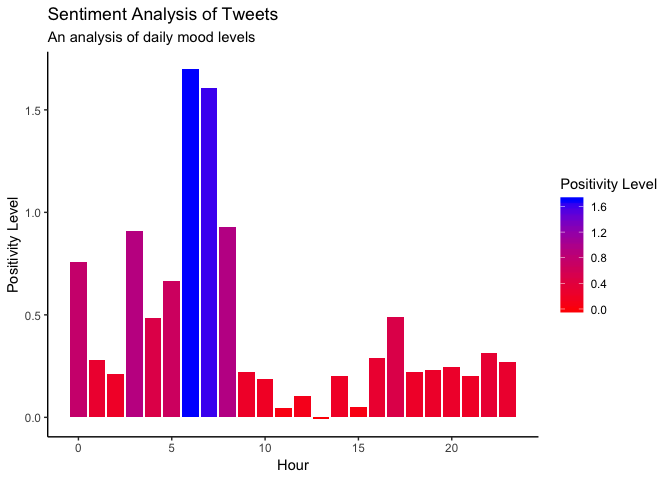
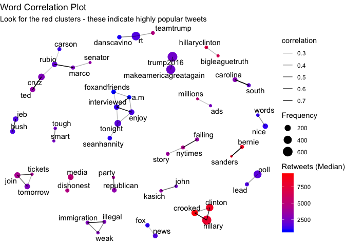
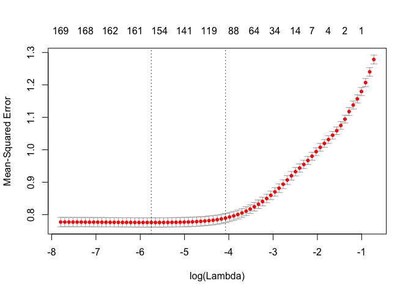
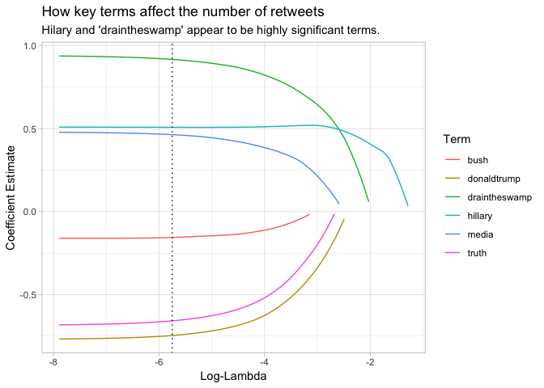

Analysis of Trump Tweets
================
Johnny Breen
05/03/2019

### Introduction

The data that I have chosen to analyse in this document is a repository of Trump tweets which span roughly two years of data all the way up until Trump's election as US president in November 2016. The original CSV file I have used in the following analysis can be found [here](https://www.kaggle.com/kingburrito666/better-donald-trump-tweets) on Kaggle.

### Credits

My analysis of Trump's tweets draws a substantial amount of insight from David Robinson's recent screencast where he analysed a repository of medium articles - that specific screencast can be found [here](https://www.youtube.com/watch?v=C69QyycHsgE) and I highly encourage anyone interested in text mining to watch it at their next available moment.

### Plan

I have outlined below the main tasks that need to be performed in order to create a simple text mining model which can be fit to the data:

-   Read in the data
-   Preprocess the data
-   Explore the data (attempt to perform sentiment & word correlation analyses)
-   Apply a machine learning model to predict the number of retweets, based on the contents of a given tweet

We would like to create a model that can take a given input tweet and assign to that tweet the predicted number of retweets based on its contents. This type of task may (with large caveats of course!) be useful for a business looking to improve their social media presence.

Preliminaries
-------------

The first step is to load any necessary packages and read in the data:

``` r
load_req_packages <- function (req_libraries = c("tidyverse", "magrittr", "broom", "widyr", "ggraph", "igraph", "tidytext", "glmnet")) {
  for (req_lib in req_libraries) {
    if (!(req_lib %in% installed.packages())) {
      install.packages(req_lib)
    }
  }
  sapply(req_libraries, require, character.only = TRUE)
}

load_req_packages() # runs the function defined above
```

    ## tidyverse  magrittr     broom     widyr    ggraph    igraph  tidytext 
    ##      TRUE      TRUE      TRUE      TRUE      TRUE      TRUE      TRUE 
    ##    glmnet 
    ##      TRUE

``` r
theme_set(theme_light()) # initialise the theme for ggplot2
```

To read in CSV data, I will make use of the `readr::read_csv()` function:

``` r
proj_root <- "~/Desktop/Data Science/R/Project Trump/" 
trump_tweets_raw <- read_csv(file = paste0(proj_root, "Data/Trump_Tweets.csv"))
```

Pre-processing
--------------

Before we pre-process the data, we can inspect the first 10 rows of the data using the `head()` function:

``` r
 trump_tweets_raw %>%
    head()
```

    ## # A tibble: 6 x 12
    ##   Date  Time  Tweet_Text Type  Media_Type Hashtags Tweet_Id Tweet_Url
    ##   <chr> <tim> <chr>      <chr> <chr>      <chr>       <dbl> <chr>    
    ## 1 16-1… 15:26 Today we … text  photo      ThankAV…  7.97e17 https://…
    ## 2 16-1… 13:33 Busy day … text  <NA>       <NA>      7.97e17 https://…
    ## 3 16-1… 11:14 Love the … text  <NA>       <NA>      7.97e17 https://…
    ## 4 16-1… 02:19 Just had … text  <NA>       <NA>      7.97e17 https://…
    ## 5 16-1… 02:10 A fantast… text  <NA>       <NA>      7.97e17 https://…
    ## 6 16-1… 19:31 Happy 241… text  photo      <NA>      7.97e17 https://…
    ## # ... with 4 more variables:
    ## #   twt_favourites_IS_THIS_LIKE_QUESTION_MARK <int>, Retweets <int>,
    ## #   X11 <int>, X12 <chr>

Questions to Ponder
===================

Straight off the bat we have a few preliminary data-based questions:

1.  Are the missing values in the `Media_Type` and `Hashtags` MCAR ("Missing Completely At Random") or MNAR ("Missing Not At Random")? In other words, do they actually
2.  Is the `Tweet_Id` useful at all? Why does it appear to be populated with a static value of `7.97e17`?
3.  What are `X11` and `X12`? Are they completely missing? They seem to stem from a parsing error when using `read_csv()` but we should verify this by glancing at the documentation for the source data

We can solve question 3 by checking the documentation - this reveals that `X11` and `X12` are likely to be due to some parsing error. We can therefore remove them. Question 2 is not as clear-cut but it does not appear to be informative so we will drop it as well.

As for question 1, I will make the assumption that `NA` indicates that either no photo was attached (in the case of `Media_Type`) or that no hashtag exists (in the case of `Hashtags`).

Pre-processing Tasks
====================

We now have a series of clear pre-processing tasks to follow:

1.  Remove redundant columns
2.  Rename columns
3.  Impute missing values on 'Media\_Type' and 'Hashtags' variables
4.  Convert the relevant variables to factors
5.  Separate dates and times into different columns
6.  Remove link quotations in the 'Tweet\_Text' field

``` r
# define which columns we would like to remove, rename and convert into factors
cols_to_remove <- c("X11", "X12", "Tweet_Id", "Tweet_Url")
cols_to_rename <- c(Tweet = "Tweet_Text", Likes = "twt_favourites_IS_THIS_LIKE_QUESTION_MARK")
cols_to_fct <- c("Type", "Media_Type", "Hashtags")

# define a simple function which can take, as input, the columns to turn into factors and output the corrected dataframe
to_factor <- function (df, cols_to_fct) {
  df[cols_to_fct] <- map_dfr(df[cols_to_fct], factor) %>%
    as_tibble()
  return(df)
}

trump_tweets_clean <- trump_tweets_raw %>%
  select(-cols_to_remove) %>% 
  rename(!!cols_to_rename) %>% # since dplyr quotes its inputs, by default, we need to communicate that we have already done this (i.e. we don't want 'rename' to take 'cols_to_rename' too literally...) by using '!!'
  replace_na(list(Media_Type = "(None)", Hashtags = "(None)")) %>%
  to_factor(cols_to_fct) %>% 
  separate(col = Date, into = c("Year", "Month", "Day"), sep = "-", convert = TRUE) %>% 
  separate(col = Time, into = c("Hour", "Minute", "Second"), sep = ":", convert = TRUE) %>% 
  mutate(Hour_Min = Hour + Minute / 60) %>% 
  select(-Minute, -Second) %>% 
  mutate(Tweet = str_replace_all(Tweet, "(www|http:|https:)+[^\\s]+", "")) %>% # remove links
  mutate(Tweet = str_replace_all(Tweet, "\\d+\\:\\d+", "")) 

trump_tweets_clean %>%
    head()
```

    ## # A tibble: 6 x 11
    ##    Year Month   Day  Hour Tweet Type  Media_Type Hashtags  Likes Retweets
    ##   <int> <int> <int> <int> <chr> <fct> <fct>      <fct>     <int>    <int>
    ## 1    16    11    11    15 "Tod… text  photo      ThankAV… 127213    41112
    ## 2    16    11    11    13 Busy… text  (None)     (None)   141527    28654
    ## 3    16    11    11    11 Love… text  (None)     (None)   183729    50039
    ## 4    16    11    11     2 Just… text  (None)     (None)   214001    67010
    ## 5    16    11    11     2 A fa… text  (None)     (None)   178499    36688
    ## 6    16    11    10    19 "Hap… text  photo      (None)   159176    44655
    ## # ... with 1 more variable: Hour_Min <dbl>

Data Exploration
----------------

We can see from the data the period of time over which this data spans:

``` r
trump_tweets_clean %>%
    select(Year, Month) %>%
    distinct()
```

    ## # A tibble: 17 x 2
    ##     Year Month
    ##    <int> <int>
    ##  1    16    11
    ##  2    16    10
    ##  3    16     9
    ##  4    16     8
    ##  5    16     7
    ##  6    16     6
    ##  7    16     5
    ##  8    16     4
    ##  9    16     3
    ## 10    16     2
    ## 11    16     1
    ## 12    15    12
    ## 13    15    11
    ## 14    15    10
    ## 15    15     9
    ## 16    15     8
    ## 17    15     7

Donald Trump was officially elected in November 2016 so it looks as though these tweets capture most of his electoral journey. It would be interesting to observe his daily activity on Twitter split by year and month:

``` r
trump_tweets_clean %>%
  ggplot(aes(Hour, fill = as.factor(Month))) +
  geom_density(show.legend = FALSE) +
  facet_grid(Year~Month) +
  theme(axis.text.x = element_text(size = 7.5)) +
  labs(y = "Density", 
       title = "Trump's Twitter Activity", 
       subtitle = "Split by year and month - Trump generally becomes active during the evenings")
```


It seems there isn't much variation in his tweeting patterns over the course of the electoral journey.

Let's turn our attention to text mining by looking at the most frequently occurring words in this dataset. To do this, we leverage the tidytext function 'unnest\_tokens' which splits each tweet into a one word per row format. To maintain an understanding of which word belongs to which tweet, we mutate the initial dataframe - before unnesting - so that each tweet has a pre-defined 'ID'. We also remove any stop-words (e.g. 'a', 'of', 'the'), digits and words like 'Trump / trump':

``` r
trump_tweets_unnested <- trump_tweets_clean %>%
  mutate(ID = row_number()) %>% 
  unnest_tokens(output = "Word", input = "Tweet") %>% # split each tweet into a series of one-word rows
  anti_join(stop_words, by = c("Word" = "word")) %>% # remove stop-words like 'a', 'the' etc.
  filter(!(Word %in% c("trump", "Trump")), str_detect(Word, "[a-z]")) # filter out any numbers

trump_tweets_unnested # check on representation of data
```

    ## # A tibble: 57,401 x 12
    ##     Year Month   Day  Hour Type  Media_Type Hashtags  Likes Retweets
    ##    <int> <int> <int> <int> <fct> <fct>      <fct>     <int>    <int>
    ##  1    16    11    11    15 text  photo      ThankAV… 127213    41112
    ##  2    16    11    11    15 text  photo      ThankAV… 127213    41112
    ##  3    16    11    11    15 text  photo      ThankAV… 127213    41112
    ##  4    16    11    11    15 text  photo      ThankAV… 127213    41112
    ##  5    16    11    11    15 text  photo      ThankAV… 127213    41112
    ##  6    16    11    11    15 text  photo      ThankAV… 127213    41112
    ##  7    16    11    11    15 text  photo      ThankAV… 127213    41112
    ##  8    16    11    11    13 text  (None)     (None)   141527    28654
    ##  9    16    11    11    13 text  (None)     (None)   141527    28654
    ## 10    16    11    11    13 text  (None)     (None)   141527    28654
    ## # ... with 57,391 more rows, and 3 more variables: Hour_Min <dbl>,
    ## #   ID <int>, Word <chr>

Now that we have split the data into a 'tidy' format, we can investigate the top 20 (say) most common used words:

``` r
trump_tweets_unnested %>%
  count(Word, sort = TRUE) %>%
  top_n(20) %>%
  mutate(Word = reorder(Word, n)) %>%
  ggplot(aes(Word, n, fill = n)) +
  geom_col(show.legend = FALSE) +
  coord_flip() +
  scale_fill_gradient(low = "blue", high = "red") +  
  theme_classic() +
  labs(x = "Term",
       y = "Frequency",
       title = "Top 20 Most Frequently Used Words",
       subtitle = "An insight into Trump's most prevalent tweet contents")
```


We can also perform an analysis of mood over the course of a defined period of time. For instance, we can observe fluctuations in Trump's mood over the course of an 'average' day:

``` r
trump_tweets_unnested %>% 
  mutate(Hour = round(Hour)) %>%
  inner_join(get_sentiments("afinn"), by = c("Word" = "word")) %>%
  group_by(Hour) %>%
  summarise(Sentiment_Score = mean(score)) %>%
  ungroup() %>%
  ggplot(aes(Hour, Sentiment_Score, fill = Sentiment_Score)) +
  geom_col() +
  theme_classic() +
  scale_fill_gradient(low = "red", high = "blue") +
  labs(y = "Positivity Level",
       fill = "Positivity Level",
       title = "Sentiment Analysis of Tweets",
       subtitle = "An analysis of daily mood levels")
```



This gives us some useful information but what might be more interesting for us is to investigate which choice of words appear to be most correlated with the number of retweets. In this case, each unique ID which we created prior to this stage comprises a series of words which form a tweet - we're looking for the correlation between different words based on how frequently they appear *together* in any given tweet. To do this we will plot a network of words using the 'ggraph' and 'igraph' packages:

``` r
# First, focus on words with a frequency of over 50 (this is subjective, you can make your own decisions here)
trump_tweets_filtered <- trump_tweets_unnested %>%
  add_count(Word) %>%
  filter(n >= 50)

# Second, of these words calculate the median number of retweets
trump_tweets_summarised <- trump_tweets_filtered %>%
  group_by(Word) %>%
  summarise(Med_Retweet = median(Retweets), Frequency = n()) %>%
  arrange(desc(Med_Retweet))

# Third, calculate the correlation between the remaining most frequent words
trump_word_corrs <- trump_tweets_filtered %>%
  pairwise_cor(item = Word, feature = ID, sort = TRUE) %>% # by 'feature' this means the variable in the data which delineates different groups of words (as tweets) 
  filter(correlation >= 0.20)

# Fourth, filter the retweets to include only words that have a sufficiently high correlation
vertices <- trump_tweets_summarised %>%
  filter(Word %in% trump_word_corrs$item1 | Word %in% trump_word_corrs$item2) 

# Finally, plot the results of the analysis above
set.seed(2018)
trump_word_corrs %>%
  graph_from_data_frame(vertices = vertices) %>%
  ggraph() +
  geom_node_point(aes(size = Frequency, colour = Med_Retweet)) +
  geom_edge_link(aes(alpha = correlation)) +
  geom_node_text(aes(label = name), repel = TRUE) +
  theme_void() +
  scale_colour_gradient(low = "blue", high = "red") +
  labs(title = "Word Correlation Plot",
       subtitle = "Look for the red clusters - these indicate highly popular tweets",
       colour = "Retweets (Median)",
       alpha = "Correlation")
```



We are now starting to observe more interpretable insights - Donald Trump's propensity to comment on rivals like Bernie Sanders and Hillary Clinton appears to be correlated with his number of retweets. This is not surprising given that the time period associated with this dataset coincides with the US election campaign leading up to November 2016.

The next step in our analysis will be to attempt to fit a penalised regression model to this data in order to understand further the most effective and least effective words to use in order to drive the number of retweets.

Machine Learning
----------------

We plan to fit a LASSO model to the data for a few reasons:

-   The LASSO model automatically performs variable selection which, in this case, amounts to omitting less important words from the model
-   This particular model is much easier to interpret both analytically and graphically

First we set up the 'X' matrix. Second we set up the target 'Y' vector to train on:

``` r
# X variate
trump_tweets_matrix <- trump_tweets_filtered %>%
  select(ID, Word) %>%
  cast_sparse(row = ID, column = Word)

# Y variate
trump_retweets <- trump_tweets_filtered$Retweets[match(rownames(trump_tweets_matrix), trump_tweets_filtered$ID)]
```

In order to fit the GLM we will use 'glmnet', a package developed by Trevor Hastie et al which facilitates the fitting of GLMs (standard and regularised). As we are only interested in interpretation, we won't bother holding out a subsection of the data for testing at this stage (the code may be amended later down the line to adjust for this). I have decided to take the log of the response variable to hopefully improve the fit of the model slightly:

``` r
trump_glm <- cv.glmnet(x = trump_tweets_matrix, y = log(trump_retweets))
plot(trump_glm)
```



We can observe from the plot above that the minimum MSE is achieved at a variable count of ~155. We can investigate the model in more detail by first tidying the model using the 'broom' package function 'tidy' and then filtering on all the series of models for the minimum lambda found above:

``` r
trump_term_influence <- tidy(trump_glm$glmnet.fit) %>% # tidy(), in this context, will summarise key model statistics in a data frame
  filter(lambda == trump_glm$lambda.min) %>%
  transmute(Word = term, Influence = estimate) # similar to mutate() but drops un-mutated variables

# Top 10 most positively influential (i.e. retweet-friendly) words
trump_term_influence %>%
    arrange(desc(Influence)) %>%
    slice(1:10)
```

    ## # A tibble: 10 x 2
    ##    Word           Influence
    ##    <chr>              <dbl>
    ##  1 (Intercept)        7.84 
    ##  2 draintheswamp      0.917
    ##  3 maga               0.791
    ##  4 imwithyou          0.675
    ##  5 hillaryclinton     0.591
    ##  6 movement           0.583
    ##  7 pennsylvania       0.566
    ##  8 carolina           0.534
    ##  9 safe               0.533
    ## 10 americafirst       0.532

``` r
# Top 10 most negatively influential (i.e. retweet-unfriendly) words
trump_term_influence %>%
    arrange(Influence) %>%
    slice(1:10)
```

    ## # A tibble: 10 x 2
    ##    Word            Influence
    ##    <chr>               <dbl>
    ##  1 realdonaldtrump    -0.975
    ##  2 donaldtrump        -0.746
    ##  3 south              -0.729
    ##  4 truth              -0.658
    ##  5 donald             -0.639
    ##  6 a.m                -0.566
    ##  7 book               -0.494
    ##  8 foxandfriends      -0.494
    ##  9 hes                -0.396
    ## 10 seanhannity        -0.394

The tables above indicate the most positively and negatively influential terms on retweets, respectively. They are the coefficient estimates associated with each term at the optimal value of the penalisation parameter lambda. We can pick out a few terms that we are interested in and observe how their influence changes as the value of lambda is decreased:

``` r
tidy(trump_glm$glmnet.fit) %>%
  filter(term %in% c("donaldtrump", "media", "bush", "draintheswamp", "truth", "hillary")) %>%
  ggplot(aes(x = log(lambda), y = estimate, colour = term)) +
  geom_line() +
  geom_vline(xintercept = log(trump_glm$lambda.min), linetype = "dotted") +
  labs(x = "Log-Lambda",
       y = "Coefficient Estimate",
       colour = "Term",
       title = "How key terms affect the number of retweets",
       subtitle = "Hilary and 'draintheswamp' appear to be highly significant terms.")
```



Conclusions
-----------

This small kernel was only intended to be a very basic introduction to the world of text mining. This code could be taken much further both in terms of exploratory analysis, data pre-processing and modelling. Potential next steps might include:

-   Investigating whether there are any external pieces of data that could be adjoined to the dataset and improve analysis. Each tweet has a timestamp - is there some external information which is influential in some way but not captured by the current data?
-   Performing more rigorous training and validation of the LASSO model with separate training and holdout sets
-   Exploring more of the relationships in the data (such as media type and hashtags or likes and retweets)

Happy text mining everybody!
